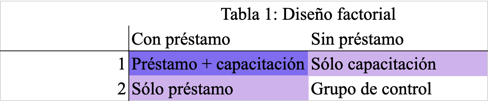
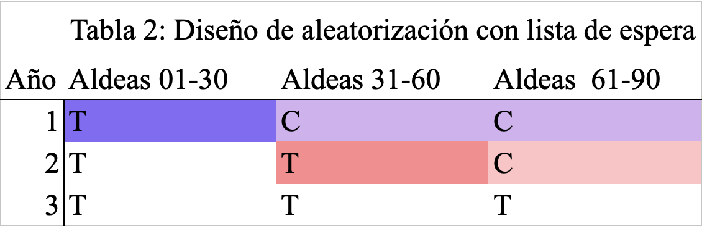

<!-- title: "10 Things You Need to Know About Randomization" -->
<!-- author: "Methods Guide Author: Lindsay Dolan" -->

Resumen
==
Esta guía le ayudará a diseñar y ejecutar diferentes tipos de asignación aleatoria en sus experimentos. Aquí nos centramos en  ideas generales y proporcionamos ejemplos y herramientas que puede utilizar en R. Para saber saber más sobre por qué aleatorizar, consulte [esta guía de métodos](http://egap.org/resource/10-strategies-for-figuring-out- si-x-causó-y).

1 Unas formas son mejores que otras
==
Hay muchas formas de aleatorizar. La más simple es lanzar una moneda para determinar si un sujeto recibe un tratamiento o no. Esto asegura que cada sujeto tenga una probabilidad de 0.5 de recibir el tratamiento y una probabilidad de 0.5 de no recibirlo. Hecho de esta manera, si un sujeto recibe el tratamiento no afecta para nada el que el siguiente sujeto reciba o no el tratamiento. Cada sujeto tiene la misma probabilidad de recibir el tratamiento y el tratamiento no estaría correlacionado con factores que puedan generar una asociación engañosa, al menos en valor esperado.


Este no es un procedimiento erróneo, pero tiene sus deficiencias. Primero, cuando usamos este método no podemos saber de antemano cuántas unidades estarán en tratamiento y cuántas en control. Si para usted es importante contar con esta información de antemano, deberá emplear alguna forma de muestreo en la que cada elemento selccionado no sea estadísticamente independientes de los otros (como sacar papeletas con nombres de un sombrero). En segundo lugar, puede que usted quiera controlar la proporción exacta de unidades asignadas al tratamiento y control, lo que es difícil de conseguir lanzando una moneda. En tercer lugar, es posible que uste quiera poder replicar su aleatorización para demostrar que no hubo nada raro con ella. Eso no se puede lograr tan fácil lanzando monedas o sacando  papeletas de sombreros. Finalmente, como mostramos a continuación, hay todo tipo de formas de hacer la aleatorización para mejorar el poder estadístico y asegurar el balance de varias formas, que son muy difíciles de lograr usando monedas y sombreros.

Sin embargo, afortunadamente, la aleatorización replicable y flexible es muy fácil de hacer con software disponible gratuitamente. El siguiente código de R se puede utilizar, por ejemplo, para generar una asignación aleatoria, especificando el número de unidades a tratar. Aquí, N = 100 es el número de unidades que tiene y m = 34  es el número que desea tratar. La "semilla" permite replicar la misma simulación cada vez que ejecuta el código (o puede cambiar la semilla por iteración diferente de la simulación). [^1] [^2]


[^1]: Los generadores de números aleatorios son en realidad pseudoaleatorios porque generan un vector de números aleatorios basado en un pequeño conjunto de valores iniciales, conocido como  estado de semilla. Los generadores de números aleatorios funcionan de esta manera para mejorar la velocidad computacional. Sin embargo, la serie de números aleatorios generada es tan aleatoria como es necesario para los propósitos de la asignación aleatoria porque no tiene ninguna relación con los resultados potenciales de sus sujetos.

[^2]: Todos los fragmentos de código fueron actualizados por Alex Coppock el 25 de noviembre de 2020.


```{r, error=FALSE, message=FALSE, warning=FALSE, results='hide'}
library(randomizr)
set.seed(343)
complete_ra(N = 100, m = 34)
```

2  Aleatorización en bloques: puede asegurarse de antemano que los grupos de tratamiento y control estén balanceados
==
Cuando aleatorizaramos podemos asegurarnos de que los grupos de tratamiento y de control estén balanceados con respecto a  factores particulares que sean de nuestro interés. Claro está, que no es posible especificar qué unidades particulares se seleccionan para cada grupo y seguir manteniendo la asignación aleatoria.

Esto significa que es posible especificar, por ejemplo, que sus grupos de tratamiento y control contengan proporciones iguales de hombres y mujeres. En otras palabras, esto evita cualquier aleatorización que pueda producir un grupo de tratamiento con sólo hombres y un grupo de control con sólo mujeres, o viceversa.

¿Por qué es esto deseable? El hecho de que queramos grupos balanceado no está relacionado con un posible sesgo en la estimación  del efecto promedio del tratamiento, sino con que la estimación podría ser muy ruidosa. Supongamos que una asignación aleatoria generara un grupo de tratamiento con muchos hombres y un grupo de control cpn muchas mujeres. En tal caso, observaríamos una correlación entre el género y el tratamiento. Si tuviéramos que estimar un efecto del tratamiento, ese efecto del tratamiento sería insesgado  porque en realidad el género no tendría ninguna influencia sobre la asignación del tratamiento. Sin embargo, sería más difícil rechazar la hipótesis nula de que es el género y no nuestro tratamiento el que produce el efecto. En resumen, el desbalance produce una estimación ruidosa, lo que dificulta tener confianza en nuestras estimaciones.

La aleatorización en bloques (a veces conocida como estratificada) nos ayuda a manipular nuestro experimento para que nuestros grupos de tratamiento y control estén balanceados en dimensiones importantes, pero que aún así se asignen al azar. Esencialmente, este tipo de diseño de aleatorización construye múltiples mini-experimentos: por ejemplo, podría tomar mujeres y asignar al azar la mitad al tratamiento y la mitad al control, y luego asignaría la mitad de los hombres al tratamiento y la mitad al control. Esto garantiza un balance con respecto al género cuando se combinan los grupos de tratamiento y de control.


El [paquete blockTools ](https://cran.r-project.org/web/packages/blockTools/index.html) es util para hacer aleatorización en bloques. Comencemos por generar datos artificiales para 60 sujetos, 36 de los cuales son hombres y 24 mujeres.

Supongamos que queremos hacer asignación en bloques en función del género. A partir de nuestros datos, blockTools generará los bloques más pequeños posibles, cada uno con dos unidades del mismo género: una asignada al tratamiento y la otra al control.

```{r, results='hide', error=FALSE, message=FALSE, warning=FALSE}
rm(list = ls())
library(blockTools)
library(dplyr)
library(randomizr)
dat <-
  tibble(
    id = seq(1:60),
    female = c(rep(0, 36), rep(1, 24)),
    age = sample(18:65, size = 60, replace = TRUE)
  )
# Bloque de una covariable
dat <-
  dat %>%
  mutate(Z_block_1 = block_ra(female))
with(dat, table(female, Z_block_1))
# Cuartetos emparajedos
out <- block(dat, n.tr = 4, id.vars = "id", 
             block.vars = c("female", "age"))
dat <-
  dat %>%
  mutate(
    block_id = createBlockIDs(out, dat, id.var = "id"),
    Z_block_2 = block_ra(block_id))
with(dat, table(Z_block_2, block_id))
```


Puede verificar la media de la variable que utilizo para crear los bloques en el tratamiento y el control para ver que los grupos estén, de hecho, perfectamente balanceados en función del género.

 

3 diseños factoriales: puede aleatorizar múltiples tratamientos al mismo tiempo sin perder poder
==
Supongamos que hay varios componentes de un tratamiento sobre los cuales se quiere hacer pruebas. Por ejemplo, es posible que desee evaluar el impacto de un programa de microfinanzas. Dos tratamientos específicos podrían ser prestar dinero a las mujeres y brindarles capacitación. Un diseño factorial analiza todas las combinaciones posibles de estos tratamientos: (1) Préstamos, (2) Capacitación, (3) Préstamos + capacitación y (4) Control. Luego, los sujetos se asignan al azar a una de estas cuatro condiciones.


{width=60%}

Los diseños factoriales son especialmente útiles para evaluar intervenciones que incluyen un paquete de tratamientos. Así como en el ejemplo anterior, muchas intervenciones de desarrollo vienen con varios componentes (brazos) y, a veces, es difícil saber qué componente está produciendo el efecto observado. Un diseño factorial separa estos diferentes tratamientos y también nos permite ver la interacción entre ellos.

El siguiente código  enseña cómo aleatorizar utilizando un diseño factorial.


```{r, results='hide'}
dat <-
  tibble(
    Z_loan = complete_ra(80, 40),
    Z_training = block_ra(blocks = Z_loan)
  )
with(dat, table(Z_loan, Z_training))
```

4 Usted puede asignar  un conglomerado todo junto al tratamiento  (¡pero cuanto más grandes sean sus conglomerados, menos poder tendrá!)
==
A veces no podemos asignar el tratamiento aleatoriamente al nivel del individuo. Por ejemplo, una propaganda radial que busque incentivar individuos a que vayan a un puesto de votación debe transmitirse a  todo los radioescuchas; es imposible transmitir solo a algunas personas pero no a otras. Ya sea por necesidad o por elección, a veces se aleatorizan conglomerados en lugar de individuos.

La desventaja de la aleatorización por conglomerados es que reduce el poder estadístico, ya que el número de unidades asignadas al azar ahora refleja el número de conglomerados y no simplemente el número total de sujetos. Si tuviera dos grupos asignados al azar de 1000 individuos cada uno, el número funcional de unidades podría estar más cerca de 2, no de 2000. Por esta razón, es preferible hacer que los conglomerados sean lo más pequeños posible.

Es de igual forma deseable que los conglomerados sean heterogéneos para que así representen  a la población general de la mejor forma posible. Si los individuos dentro de cada conglomerados son muy parecidos entre sí, puede que sus resultados potenciales también lo sean, y ese grupo de individuos con resultados potenciales similares se asignará al tratamiento o control todo junto como grupo. En general, esto aumentaría la varianza si ese conglomerado tiene resultados potenciales particularmente altos o bajos porque aumenta la correlación general entre los resultados potenciales y la asignación del tratamiento. En resumen, si sus conglomerados son más representativos de la población en general, sus estimaciones del efecto promedio del tratamiento serán más precisas.


Una pregunta frecuente es en qué se diferencia la aleatorización por conglomerados de la aleatorización en bloques. La aleatorización en bloques se realiza para lograr un equilibrio basado en las covariables definidas previas al tratamiento. Por ejemplo, una intervención educativa podría crear bloques de acuerdo a los puntajes de las pruebas del año anterior para rastrear el progreso de los estudiantes de bajo y alto rendimiento. En cambio, la aleatorización por conglomerados es cuando varias unidades son tratadas como  grupo: todas reciben el tratamiento o todas están en el grupo de  control juntas. Continuando con el mismo ejemplo de la intervención educativa, la aleatorización podría hacerse al nivel del aula. En ese caso  las aulas constituyen los conglomerados. Es posible aleatorizar en bloques y por conglomerados simultaneamente. En nuestro ejemplo, puede calcular el puntaje promedio de la prueba para cada aula y realizar una asignación aleatoria en bloques según el puntaje promedio del aula.

El siguiente gráfico muestra cómo se verían sus datos en los casos de aleatorización en bloques, conglomerados y bloques + conglomerados, en relación con un caso simple de aleatorización sin bloques ni conglomerados. En los dos casos en los que  hay conglomerados, puede darse cuenta que la asignación al tratamiento (diferenciada por color) aparece en grupos pequeños. En los dos casos en los que hay bloques, hay una distribución uniforme de colores en los cuatro cuadrantes del gráfico, los bloques de esta asignación aleatoria.
<!-- need to change file location-->

<center>_
Ilustración de los patrones de las unidades de tratamiento y control que se pueden dar en diferentes tipos de diseños con bloques y conglomerados._</center>


5 Puede aleatorizar de manera que sea fácil identificar si hay derrame de efectos
==
Al diseñar su experimento, reflexione sobre  si la "derrame" representa una amenaza para su capacidad de identificar el efecto causal de su tratamiento. Los efectos de derrame surgen si el resultado de una unidad se ve afectado por que otra unidad reciba o no el tratamiento. Esto puede ser complicado si las unidades tienen la capacidad de interactuar entre sí: un miembro de una aldea puede enterarse de que otro aldeano ha recibido un subsidio en efectivo y puede cambiar su comportamiento en consecuencia.

Una forma de hacer que los efectos de derrame sean más evidentes es utilizar la doble aleatorización. Primero asignar aleatoriamente algunos conglomerados al tratamiento y otros al control, y dentro de los conglomerados, asignaría algunos individuos al tratamiento y otros al control. La comparación de los individuos de control de su conglomerados de tratamiento con los de su conglomerado de control le permitirá evaluar el papel de los efectos secundarios en su experimento.


6 Las probabilidades de asignación al tratamiento pueden variar de una unidad a otra
==
A veces se tiende a creer que algo "aleatorio" significa que dos eventos son igualmente probables, pero de hecho, la asignación aleatoria es "aleatoria" siempre que la probabilidad de asignación al tratamiento esté estrictamente entre 0 y 1. Si un sujeto tiene un 0 o un 100 por ciento de probabilidad de ser asignado a un tratamiento, ese sujeto debe excluirse del análisis experimental porque sus resultados no serían afectados por la aleatorización. Sin embargo, siempre que se conozcan sus probabilidades, se pueden incluir todos los sujetos con una probabilidad de asignación al tratamiento estrictamente entre 0 y 1, incluso si sus probabilidades difieren.

¿Por qué querríamos tener diferentes probabilidades de asignación al tratamiento? Suponga que está trabajando con un socio implementador para distribuir al azar la asignación de vehedores electorales con el fin de medir sus efectos sobre el fraude electoral. Su socio implementador puede enviar solo unos pocos vehedores electorales a una zona rural del país. Usted puede abordar esta restricción creando bloques en función del área geográfica y asignando una mayor probabilidad de asignación al tratamiento a las aldeas más cercanas a las que es menos costoso viajar. Siempre que la probabilidad de asignación al tratamiento para las aldeas más accesibles sea menor que 1, la probabilidad de asignación al tratamiento para las aldeas menos accesibles sea mayor que cero y se conozcan estas probabilidades, es posible estimar el efecto del tratamiento.


Sin embargo, cuando los sujetos tienen diferentes probabilidades de ser asignados al tratamiento, ya no puede simplemente juntar todos los sujetos para el análisis de sus datos. Si lo hace, la asignación de tratamiento estará correlacionada con las características de contexto que utlizó para los bloques. Hay dos formas de manejar esto.

La primera  es estimar el efecto del tratamiento promedio bloque por bloque y luego promediar los efectos del tratamiento, cada uno ponderado por el tamaño del bloque en relación con la muestra completa.

La segunda forma es la ponderación de probabilidad inversa (PPI; Inverse probability weight, IPW). Para calcular la PPI, los pesos se definen como 1/p para las unidades tratadas y 1/(1-p) para las unidades de control, donde p se refiere a la probabilidad de asignación al tratamiento. Este método le permite ejecutar una regresión ponderada de Y en la asignación de tratamiento.


```{r, results='hide'}
N <- 100000
dat <- tibble(Y0 = 1:N,
              Y1 = Y0 + 10000)
dat <-
  dat %>%
  mutate(
    p = seq(0.25, 0.75, length.out = N),
    Z = simple_ra(N, prob_unit = p),
    Y = Z * Y1 + (1 - Z) * Y0)
  
dat %>%
  summarise(
    naive_estimate = mean(Y[Z == 1]) - mean(Y[Z == 0]),
    ipw_estimate = weighted.mean(Y[Z == 1], 1 / p[Z == 1]) -
      weighted.mean(Y[Z == 0], 1 / (1 - p[Z == 0]))
  )
```

7 Aleatorización restringida: si no le gusta lo que obtiene, puede empezar de nuevo
==
Descartar una asignación aleatoria porque no nos gusta lo que resultó puede parecer incoherente con la idea general de la aleatorización. Pero a veces tiene sentido hacerlo. Puede que quiera asegurarse de que la aleatorización no produzca patrones particulares (por ejemplo, demasiadas personas que se conocen entre sí y todas reciben el tratamiento). Pero los patrones que le interesan pueden ser demasiado difíciles de especificar de antemano. Lo que puede hacer entonces es hacer un sorteo al azar y luego ver si la asignación sorteada cumple con los criterios que necesita o no,  de no ser así, puede  volver a sortear. Sin embargo, tenga en cuenta que si hace esto, genera un par de complicaciones: (1) puede que las unidad no tengan la misma probabilidad de asignación y (2) es posible que las unidades no se asignen de forma independiente al tratamiento. Debe tener en cuenta estos dos hechos en su análisis. Por ejemplo, generando ponderaciones de probabilidad inversa como hicimos en el punto 6, pero usando el mismo código de aleatorización restringido para determinar qué tan probable es que cada sujeto sea asignado al tratamiento bajo estas restricciones. Luego, utilizar la distribución de posibles asignaciones al tratamiento para hacer poder inferencia basada en la aleatorización (randomization inference). Estos análisis son complejos, así que proceda con precaución.

8. Escriba un código para aleatorizar que le permita simular muchas aleatorizaciones posibles
==
Una ventaja de utilizar código de R para aleatorizar es que puede realizar miles de aleatorizaciones en segundos. ¿Cuál es el benificio de esto?

1. Puede ser útil como una forma de verificar si su código para aleatorizar  funcionó bien. Por ejemplo, si uno o más sujetos en su experimento no recibieron el tratamiento en ninguna de las 10,000 posibles asignaciones aleatorias, entonces hay razones para sospechar que puede haber un error en su código de aleatorización.
2. Puede usar la reasignación aleatoria para calcular la probabilidad exacta de asignación al tratamiento para cada individuo en su experimento. Esto es especialmente útil si su código para aleatorizar es complejo. Quizás esté asignando el tratamiento en bloques y por conglomerados, lo que da como resultado probabilidades de asignación al tratamiento muy diferentes para cada individuo en un experimento grande. Estas probabilidades serían difíciles de calcular a mano, pero una solución fácil es ejecutar su código para aleatorizar original muchas veces y generar una variable que represente la proporción de veces que cada individuo fue asignado al tratamiento: esto representa su probabilidad individual de asignación al tratamiento.  Luego puede usar esta variable en una regresión ponderada para calcular el efecto promedio del tratamiento.
3. La simulación de posibles aleatorizaciones es un enfoque basado en el diseño para calcular la significancia estadística. Este enfoque, llamado inferencia basada en aleatorización (randomization inference), genera un valor p exacto calculando los posibles efectos promedio del tratamiento que se observarían bajo asignaciones aleatorias hipotéticas asumiendo que el tratamiento no tuviera ningún efecto. El valor p es entonces la proporción de los efectos estimados del tratamiento que es al menos tan grande en magnitud como el que observó su experimento. Es mucho mejor este enfoque que calcular la significancia estadística utilizando pruebas estándar cuando la distribución de los datos no es normal,  ya que la inferencia basada en la aleatorización evita hacer supuestos de la distribución de los datos y, en cambio, utiliza la distribución de los datos observados en su experimento. Para obtener más información sobre la inferencia de aleatorización, incluido el código de muestra, visite la [10 cosas que debe saber sobre la inferencia basada en la aleatorización](https://egap.org/resource/10-things-to-know-about-randomization-inference/) Guía de métodos .

9 Puede aleatorizar conforme avanza
==

Es posible que no conozca la muestra total al comienzo de algunos experimentos. Por ejemplo, puede que unos sujetos se unan más tarde al experimento. Esto puede representar una complicación si queremos asignar el tratamiento usando aleatorización en bloques, ya que la adición de sujetos a nuestro grupo puede cambiar la composición de nuestros bloques y por lo tanto sus probabilidades de asignación al tratamiento.

Para poder continuar utilizando el algoritmo de asignación en bloques y, por lo tanto, continuar teniendo un balance entre los grupos de tratamiento y control, puede emplear covariables para calcular la similitud entre cada nuevo sujeto y los sujetos previamente asignados, y así asignar el nuevo sujeto a la condición de tratamiento que tenga menos unidades similares a este. [^3] [^4]

[^ 3]: Para obtener más información, consulte Moore, Ryan T. y Sally A. Moore. “Blocking for sequential political experiments.” Political Analysis 21.4 (2013): 507-523.


[^ 4]: Para obtener un tutorial más detallado sobre los procedimientos de aleatorización disponibles en el paquete R randomizr, consulte: https://declaredesign.org/r/randomizr/articles/randomizr_vignette.html

10 A veces aa aleatorización puede ser una forma ética de asignar un tratamiento, pero a veces no.
==
Aunque la aleatorización es el elemento clave para aislar un efecto causal de un tratamiento desde la perspectiva del diseño de investigación, también es importante considerar las implicaciones éticas de esta. Con respecto a los efectos de largo plazo de un experimento, la aleatorización nos permite determinar qué programas son más efectivos para que los recursos puedan dirigirse a programas que representen una mayor diferencia en la vida de poblaciones que podrían recibir el tratamiento en el futuro. A corto plazo, la distribución aleatoria del acceso a un programa (en contraposición a la distribución basada en características arbitrarias) puede ser una forma particularmente ética de distribuir bienes escasos que no se pueden extender a todos.

Sin embargo, a veces son las poblaciones más necesitadas las que necesitan ser atendidas por una intervención en un experimento. Un diseño aleatorio que trata a un número igual de participantes de bajos ingresos y de altos ingresos con préstamos está permitiendo que los recursos fluyan a menos personas necesitadas en lugar de a más. Si creemos que el préstamo tiene efectos beneficiosos, entonces se habría inquietudes sobre la ética de la asignación de recursos a otras personas que a los más necesitados [^5].  En ese caso, se necesitaría tener un argumento sólido para los beneficios sociales de la investigación y se deberían buscar diseños que también proporcionen beneficios al grupo de control.


[^5]: Pero si estamos seguros de los efectos del préstamo, tampoco estaría claro por qué estaríamos realizando un experimento para probarlo. En la investigación médica, a menudo se detienen los ensayos clínicos aleatorizados si se hace evidente desde el principio que un medicamento puede sin duda curar enfermedades potencialmente mortales y, por lo tanto, es peligroso negarlo a los sujetos de control. (De manera similar, un ensayo también se detendría si fuera claro desde el principio que un medicamento indudablemente está causando efectos negativos y dañinos).

Un diseño de aleatorización con lista de espera es una forma de tratar a un grupo completo de sujetos al tiempo que permite al investigador probar la efectividad del tratamiento de manera experimental. En este diseño, el programa podría implementar la intervención en fases y asignar aleatoriamente las unidades a la fase en la que serán tratadas. Por ejemplo, si un programa quisiera tratar 90 aldeas en total, podría tratar 30 aldeas cada año y medir los resultados al final de cada año. Si quisiera comparar los resultados en las aldeas de tratamiento y control, compararía las 30 aldeas tratadas con las 60 aldeas que aún no recibieron tratamiento al final del primer año. Al final del segundo año, podría comparar las 30 aldeas que fueron tratadas el año anterior con las 30 aldeas que aún no recibieron tratamiento. Esencialmente, esto crea dos experimentos idénticos, excepto por el año de diferencia. En la siguiente tabla, puede ver que para el primer año, podemos comparar el grupo de tratamiento (en morado oscuro) con los dos grupos de control (en morado claro). En el segundo año, podríamos comparar un grupo de tratamiento (en rojo oscuro) con el otro grupo de tratamiento (en rojo claro), pero debemos evitar agrupar los dos grupos de tratamiento porque uno ha sido tratado por más tiempo que el otro. Como puede ver, después del tercer año no se pueden hacer más comparaciones porque todas las unidades han sido tratadas.


{width=60%}

El único requisito es que la asignación de un sujeto al tratamiento en una fase particular se asigne al azar y no esté relacionada con sus posibles variable de resultado. Un diseño en el que los participantes más entusiastas recibieran tratamiento antes violaría este supuesto y no arrojaría una estimación insesgada del efecto del tratamiento, ya que los factores no observados que los predisponen a buscar tratamiento pueden estar influyendo en los resultados potenciales de su programa. El diseño de aleatorización con  lista de espera es un ejemplo de un diseño de aleatorización creativo que podría abordar las preocupaciones éticas sobre la limitación de la distribución de un tratamiento valioso.

A menudo, las preocupaciones éticas  están muy entrelazados con los diseños aleatorios, especialmente en las ciencias sociales y la investigación médica. Como investigador, debe considerar cuidadosamente las posibles implicaciones de asignar al azar un tratamiento dado. También deberá solicitar la aprobación de su diseño de investigación al Consejo de Revisión Institucional (Institutional Review Board, IRB) de su institución de investigación.


