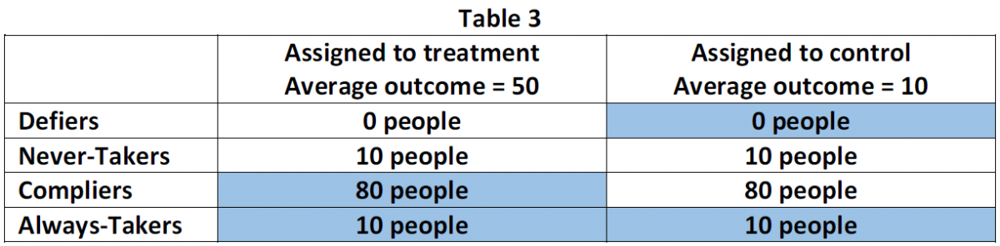

#1 What it is.

When subjects do not receive the treatment to which they were assigned, the experimenter faces a "non-compliance" problem. Some subjects may need the treatment so badly that they will always take up treatment, irrespective of whether they are assigned to the treatment or to the control group. These are called "Always-Takers". Other subjects may not take the treatment even if they are assigned to the treatment group: the "Never-Takers". Some subjects are "Compliers". These are the subjects that do what they are supposed to do: they are treated when assigned to the treatment group, and they are not treated when they are assigned to the control group. Finally, some subjects do the exact opposite of what they are supposed to do. They are called "Defiers". Table 1 shows these four different types of subjects in the population.

 

Non-compliance can make it impossible to estimate the average treatment effect (ATE). For example, say that in a population of 200, 100 people are randomly assigned to treatment and we find that only 80 people are actually treated. What is the impact of the treatment? One method to answer this question is simply to ignore the non-compliance and compare the outcome in the treatment (100 people) and control (100 people) group. This method gives the intention to treat effect (ITT). While informative, this method does not give a measure of the effect of the treatment itself. Another approach would be to compare the 120 really-untreated and 80 really-treated subjects. Doing so, however, might give you biased estimates. The reason is that the 20 subjects that did not comply with their assignment are likely to be a non-random subset of those that were assigned to treatment.

So what now? In some cases it is possible to measure the "Local Average Treatment Effect" (LATE). LATE estimates the treatment effect for the Compliers. For simple problems like this it is easily calculated as the ITT estimate divided by the share of compliers in the population.


# 2 With one-sided noncompliance you need to satisfy an exclusion restriction to justify LATE

The example introduced above is termed one-sided non-compliance: 80% of the population respond to the treatment assignment (the "Compliers") and 20% does not (the "Never-Takers"). Say that after the treatment, the experimenter measures the average outcome to be 50 in the treatment and 10 in the control group. This situation is illustrated in Table 2. Note that only those indicated with blue in Table 1 were in fact treated.

 


Before we can calculate the LATE under one-sided noncompliance we need to make an assumption. The exclusion restriction (also called "excludability") stipulates that potential outcomes respond to treatments, not treatment assignments. In normal words this simply means that the outcome for a Never-Taker is the same regardless of whether they are assigned to the treatment or control group: in both cases the subject is not treated, and that is what matters.

Because the treatment was randomly assigned, we know that if there are 20% Never-Takers in the treatment group (left column) there are also 20% Never-Takers in the control group. Because of the exclusion restriction, the Never-Takers have the same outcome under both assignment conditions, and thus the difference in average outcomes (40) cannot be attributed to the Never-Takers. We can thus leave them out of the analysis altogether, and focus on the Compliers. The LATE is therefore equal to the ITT divided by the share of Compliers: 40/0.8 = 50.

# 3 The LATE can be calculated for two-sided non-compliance assuming both the exclusion restriction and a "no defiers" assumption

The experimenter may also face two-sided non-compliance. In this case, some subjects in the treatment group go untreated and some in the control group receive the treatment. In this world, the population consists of the Compliers, the Never-Takers, the Always-Takers, and the Defiers. To calculate LATE under two-sided noncompliance we need a second assumption: that the sample contains no Defiers (the assumption is also called the "monotonicity" assumption). To see the use of this assumption look at Table 2 that illustrates our example under two-sided compliance. Again, after the treatment the experimenter measures the average outcome to be 50 in the treatment and 10 in the control group. Note that those subjects in blue were in fact treated.

 

With the exclusion restriction and the no Defiers assumption we can calculate the LATE. Because of the exclusion restriction we do not have to take into account Never-Takers and Always-Takers. Given that we know the ITT (4), what remains is to estimate the share of Compliers in the population. Because there are no Defiers we can calculate the share of Never-Takers in the treatment group (left column): 10 people. Because the treatment was assigned randomly we know there are also 10 Never-Takers in the control group. From this we are able to calculate the share of Compliers: 0.8. As a result, the LATE is equal to 40/0.8=50.

#4 The LATE is an instrumental variables estimate

The LATE estimate is equivalent to an instrumental variables estimate. This is most easily illustrated following a set of regressions. Say that 100 individuals from a population of 200 are randomly assigned to treatment. Regressing treatment status (T) on the treatment assignment (Z) gives the share of compliers: 80%. The ITT is obtained by regressing outcome Y on the assignment to treatment (Z). Again, LATE is calculated by the dividing the estimate of the latter by the first. A researcher will get exactly the same results when running a 2SLS regression in which the outcome (Y) is regressed on the treatment (T), using the assignment to treatment as an instrumental variable (Z). This is shown in the code below.

```{r include=FALSE, cache=FALSE}
library(AER)
```

```{r}
set.seed(1) 
T <- rep(0:1,50)
D <- T
D[1:10]  <- 0    # 10 Never Takers
D[11:20] <- 1    # 10 Always Takers
Y        <- 50*D
Y[1:10]  <- 100  # Never takers have high Y
Y[11:20] <- 0    # Always takers have low Y


# Share of compliers 
ITTD <- coef(lm(T~D))[2] 

# Intention to treat effect
ITT  <- coef(lm(Y~T))[2] 

# LATE
LATE <- ITT / ITTD

cbind(Y_1 = mean(Y[T==1]), Y_0=mean(Y[T==0]), ITTD, ITT, LATE)

# library(AER) 
summary(ivreg(Y~ D | T)) 

```


# 5 The LATE only estimates the treatment effect for the compliers

While LATE is better than nothing, it provides a consistent estimate of the average treatment effect (ATE) only for a subgroup of the population: the Compliers. It does not measure the effect of the treatment for everyone (ATE). For instance, Angrist and Evans (1998) study the effect of childbearing on a mother's labor supply. In their paper, compliers account for only 6% of the total population, while we would like to know the effect for everyone, or at least for a larger subgroup of the population of interest.[^1] Whether or not only obtaining the effect for Compliers is problematic depends on an experimenter's objectives. Sometimes the LATE is exactly what the researcher is interested in: those that actually comply with the assignment to treatment. Moreover, LATE might not be very different from the ATE if there are many compliers and the treatment effects for the different types in the population are very similar. To explore the latter, researchers can compare the background attributes of the Compliers and Never-takers in the treatment group. Another approach is to compare the average outcome of Always-Takers and Compliers among those that are treated (those in blue in Table 2), and the average outcome of Never-Takers and Compliers among those that are not treated.[^2]

[^1]: Angrist, J. D. Evans, W. N. 1998. Children and their Parents' Labor Supply: Evidence from Exogenous variation in family size. American Economic Review, 88(3), 450-477.


[^2]: See: Imbens, G. W. (2010). Better LATE Than Nothing: Some Comments on Deaton (2009) and Heckman and Urzua (2009). Journal of Economic Literature, 48, 399-423. And Imbens, G. W., & Angrist, J. D. (1994). Identification and Estimation of Local Average Treatment Effects. Econometrica, 62(2), 467-475, and 2). And Imbens, G. W. & Wooldridge, J. 2007. Lecture notes and slides at: http://www.nber.org/minicourse3.html.

# 6 A different instrument will give a different LATE

Whether a subject is a Defier, Complier, Never-Taker or Always-Taker depends on the experimental design and the context in which the experiment is conducted. For example, using phone calls instead of a monetary incentive to encourage treatment take-up can alter the share of compliers in the population. As a result, different instruments will estimate different LATEs.

# 7 The LATE estimate is always larger than the ITT estimate

The LATE is calculated as the intention to treat estimate (ITT) divided by the share of compliers in the population. With non-compliance, the share of Compliers in the population is smaller than one. As a result, the LATE will always be larger than the ITT estimate. Another way to look at this is that following the exclusion restriction (reminder: the exclusion restriction states that the outcome for a Never-Taker is the same regardless of whether they are assigned to the treatment or control group: in both cases the subject is not treated, and that is what matters), the ITT for the Never-Takers and the Always-Takers is zero: their outcome is the same in the treatment and control group. Thus, given any positive number of Never and/or Always-Takers, the ITT is lower than the LATE.

# 8 You can use LATE for "encouragement" designs

In an encouragement design, subjects are randomly invited to participate in the treatment. The reason to do so is that in some cases it might be unethical to make subjects adhere to the treatment assignment. In other cases, it might require unnecessarily large incentives to obtain adherence. As a result, in encouragement designs subjects self-select into treatment. For example, Hirano et al (2000) study the impact of a letter encouraging inoculation of patients at risk for flu, to a randomly selected set of physicians. The outcome of interest is an indicator for flu-related hospital visits. Needless to say, the incentives for the treatment (the letter) have only a limited effect on the actual treatment received (a flu shot by the physician), and thus the study population will consist of Compliers, Always-Takers, and Never-Takers. (We assume there are no Defiers, patients who would get the flu shot, if and only if they did not get the letter.) It is thus easy to see how such an encouragement design corresponds to the two-sided non-compliance case.[^3]

[^3]:Hirano, K., Imbens, G.W., Rubin, D.B. & Zhou, X. (2000). Assessing the Effect of an Influenza Vaccine in an Encouragement Design. Biostatistics, 1(1), 69-88.]

# 9 You can use the LATE to implement downstream experiments

Downstream experiments are studies in which an initial randomization (e.g. distribution of school vouchers) causes a change in an outcome (e.g. education level), and this outcome is then considered a treatment affecting a subsequent outcome (e.g. income).[^4] Also, these experiments correspond to our two-sided noncompliance setup. Noncompliance occurs because the random intervention is just one of many "encouragements" that cause people to take the treatment. Downstream experiments place particular pressure on the exclusion restriction, which requires that (following the example) school vouchers influences income only through higher education. This assumption would be violated if school vouchers affected income for reasons other than education.

[^4]: See: Green, D. P. & Gerber, A. S. 2002. The Downstream Benefits of Experimentation. Political Analysis, Vol. 10(4), 394-402.

# 10 You can estimate a LATE for designs with "partial compliance"

"Partial compliance" occurs when a subject is assigned to a treatment but receives less than "all" of the treatment. This is possible in designs with compound treatments, multi-arm designs like factorial designs, and in dose-response trials where the treatment variable is continuous. For example, subjects assigned to a three-session job training program may only attend two of the three sessions. Patients in a clinical trial assigned to receive 100 mg dosages of an experimental drug once every week for five weeks may only receive four of the five assigned doses. Addressing partial compliance can be especially complicated because the effective number of treatments subjects could receive exceeds the number of treatments intended in the original design. This expansion of the number of treatment conditions affects the definition of the LATE and how to estimate it. First, the number and definition of compliance statuses changes. The categories used in designs with a binary treatment (Always-Takers, Never-Takers, Compliers, and Defiers) no longer apply. Instead, the set of possible compliance statuses is determined by all possible combinations of treatment assignment and treatment receipt. In the binary case, we ruled out Defiers. In the partial compliance case, we can make similar (design-specific) monotonicity assumptions that rule out some theoretically possible compliance statuses. Finally, we are no longer interested in a single LATE. Partial compliance means that the number of quantities we are trying to estimate increases. Unfortunately, the IV/2SLS estimator used under one- and two-way noncompliance in two-group designs is a biased estimator of LATEs under partial compliance. Instead, Bayesian approaches have emerged as an alternative method for inference.[^5]

[^5]: See Qi Long, Roderick J. A. Little, and Xihong Lin. 2010. Estimating Causal Effects in Trials Involving Multi-Treatment Arms Subject to Non-compliance: A Bayesian framework. Journal of the Royal Statistical Society: Series C (Applied Statistics), 59(3): 513-531.; Jin, H. & Rubin, D. B. (2009). Public schools versus private schools: Causal inference with Partial Compliance. Journal of Educational and Behavioral Statistics, 34, 24-45; Jin, H. & Rubin, D. B. (2008). Principal Stratification for Causal Inference with Extended Partial Compliance. Journal of the American Statistical Association, 103, 101-111.

