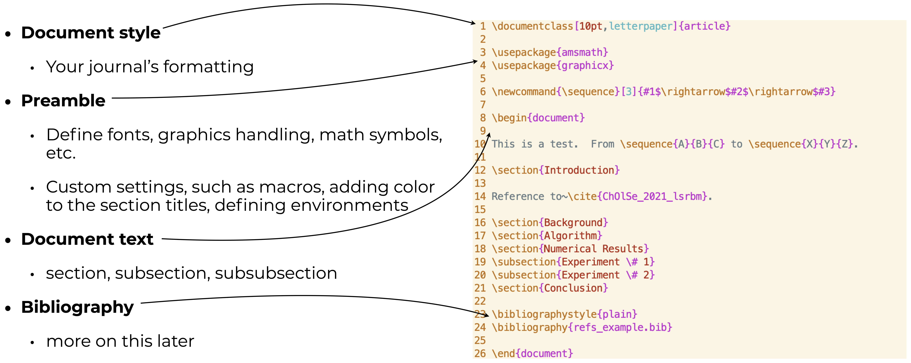
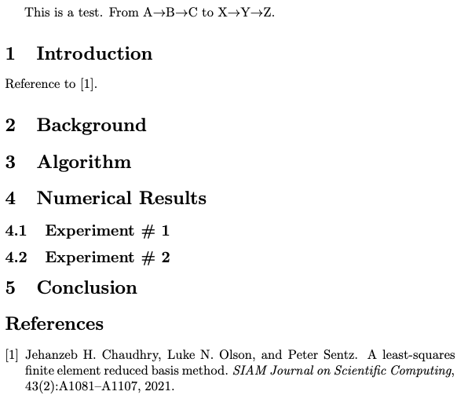
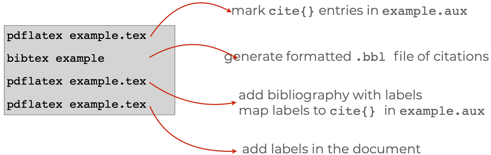
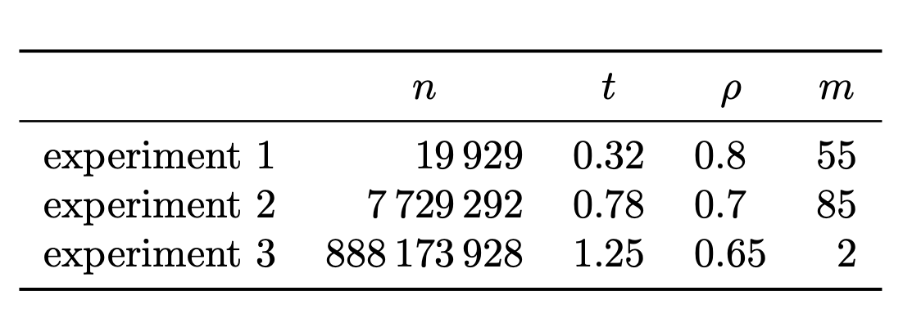
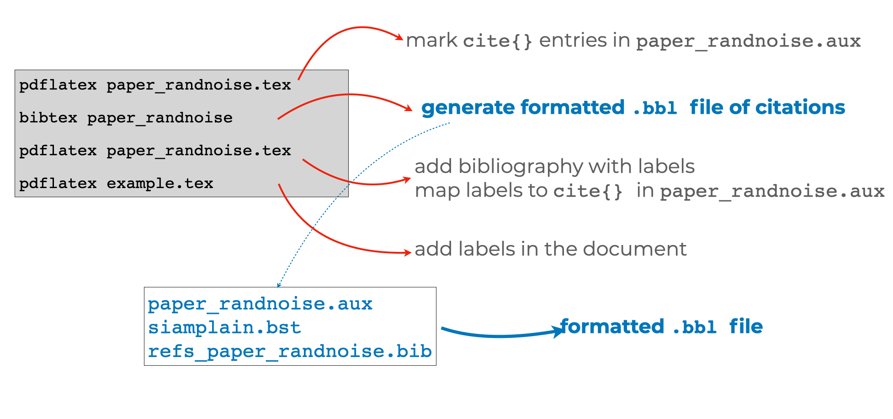
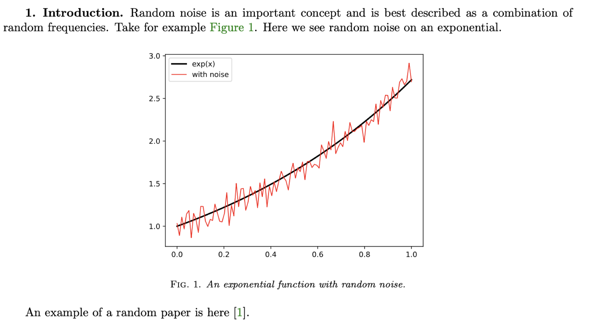

Writing is a time-consuming process; writing high-quality publications requires
attention to detail at every step of the way, from the actual prose on paper to
its layout in the document to the presentation of figures.  In this guide we
walk you through 10 aspects of writing a scientific article using
[LaTeX](https://en.wikipedia.org/wiki/LaTeX) to format your work and save you
time.  We emphasize typing commands at the [unix command
line](https://en.wikipedia.org/wiki/Unix_shell) in this guide as a way for you
to peek under the hood of the LaTeX engine. This will allow you (the author!)
power over the production of your own academic documents.^[We have decided to
write this guide in a very opinionated way. And we emphasize the nitty gritty of
technical document creation. If these opinions inspire a reader to write a 10
Things Guide on using Markdown or Google Docs please do write one! As an
open-source document, we are also happy to receive pull requests for
improvements to this guide.]

This guide could be extremely long. There are *many*, *many* fantastic resources
on typesetting. Here we have hand-selected 10 topics to help lower the barrier to a
more efficient and higher quality paper writing workflow. Specifically we focus on

1. The **structure** of a document
1. **What** are all of these tools? `tex`, `latex`, `pdflatex`, `xelatex`, `lualatex`, etc
1. LaTeX **happy workflows** for your paper
1. git and **version control**
1. Journal **style**
1. On **writing**, an interlude
1. **Dos** and Don’ts
1. On **bibliographies**
1. On **figures**
1. Handy **tools**

<!-- We provide a pile of links to graphical interfaces to LaTeX at the end of the document, however emphasizing that value of  -->

To help people **practice** these commands we have hands-on examples ready in a [JupyterLab](TODO)
session, through [Binder](https://mybinder.org/).  Here you can follow along, processing
documents in a terminal session. You can start this environment here:
[](https://mybinder.org/v2/gh/bowers-illinois-edu/egap-latex-guide/HEAD?urlpath=lab).

To use LaTeX on your own computer, you will need to [install it](https://www.latex-project.org/get/#tex-distributions) (we highly recommend following the links therein to TeX Live on each system).

# 1. Structure and Markup

A LaTeX document (or a `.tex` file) is a [plain
text](https://en.wikipedia.org/wiki/Plain_text) document that contains commands
that guides the LaTeX processing program how to create a beautiful pdf. These commands
can be "markup" like `\textbf{this is bold}` for **bold text** or `$\alpha +
\beta \frac{1}{x^2}$` for math like $\alpha + \beta \frac{1}{x^2}$ or commands
that tell LaTeX about document structure like `\section{Introduction}` or even
commands to identify a bibliography like
`\bibliography{refs_example.bib}`.

Once you have a plain text document with markup, you then process it using a
set of programs to create a publishable output like a `.pdf` file.
This figure shows an example of a LaTeX document and highlights different
 parts of the document and their role.



After processing that document (via, say, the command `latexmk -pdflatex
example.tex`, assuming that the document is called `example.tex`), one can see
a pdf file like the following image:

{ style="width: 50%; margin: auto; text-align: center; border: 1px;" }

## Takeaways

- A LaTeX document is comprised of mainly two sections: preamble, which defines the styling, and the document text.
- The LaTeX system separates concerns by allowing you to focus writing
content in a plain text document, following by processing.
- Processing the typed document delivers a layout that automatically handles spacing (as we will see later).

## Practice

What does `example.tex` look like when compiled to a pdf document? Can you add
a title or author? Can you make some text bold?^[Try out `\title{Some Paper}`
and `\author{Some Person}` *in the preamble* and `\maketitle` just after the
`\begin{document}` line.] You can practice by following these steps (and similar ones) later sections:

1. select the directory `1_structure` in the JupyterLab window that launches when you clink on `launch
binder` from the `readme.md` file in the [associated github
repository](https://github.com/bowers-illinois-edu/egap-latex-guide)
2. Then clicking on the `Terminal` icon in the JupyterLab pane
3. Once you are there, try typing `latexmk -pdflatex example.tex` and then looking at the pdf.

You can also copy the github repository to your own local machine and launch
the Terminal to see a Unix command prompt if you are using a Mac or Linux
machine. Windows machine also offer a unix command prompt, but it is a [bit
more involved to install
it](https://docs.microsoft.com/en-us/windows/wsl/install-win10).


# 2. Flavors and Programs: `tex`, `latex`,  `pdflatex`, etc

Although the most basic program that parses markup is called `latex`, in
current daily use, you will mostly find yourself using `pdflatex` or even `xelatex`
or maybe `lualatex`.

When [Donald Knuth](https://en.wikipedia.org/wiki/Donald_Knuth) created this
approach to making beautiful scientific documents, he started with the `tex`
program but [Leslie Lamport](https://en.wikipedia.org/wiki/Leslie_Lamport)
built `latex` by combining multiple `tex` commands into fewer and simpler
macros. Both originally created documents in `dvi` or `postscript` format.
Nowadays, `pdf` files are the best way to make a document that looks the same
to all who want to view it on their screens or print it for themselves.

Here is a list of the common programs that one might use to create a pdf file from a latex document:

- `tex`: a program that typesets TeX directives or macros
- `pdftex`: a program that generates a PDF (instead of DVI)
- `latex`: a program that typesets a pile of LaTeX directives and macros
- `pdflatex`: a program that generates a PDF from LaTeX
- `bibtex`: a program to take bibliographic information from a `.aux` file
  (created by a run of `latex` or `pdflatex` etc.) and generates a
  bibliography.
- `biber`: a program like bibtex but with more database management
  capabilities.
- `xelatex`: support for a wide variety of fonts and characters (you can type
  `xelatex example.tex` after [changing the
  font](https://www.overleaf.com/learn/latex/XeLaTeX) to one that is installed
  on your system).
- `lualatex`: extends latex so that more programming can be done within it
  (via Lua for more complicate document designs and workflows. See [here for more on lualatex](https://www.overleaf.com)). TODO fix link

For example, at the command prompt in the Terminal, you might type
`pdflatex example.tex` create an `example.pdf` file (if you only do it once,
the citation will show up as a `?` and no bibliography will be printed).

Notice also:

- `pdflatex` (or `xelatex` or `lualatex`) takes several passes --- it must be run
   more than one time --- if your document involves citations or other more
   complex features (like cross-references, tables of contents, etc.).
- Tools like `latexmk` or `latexrun` automate this process of multiple passes
   by a latex processing program and a bibliography creation program.

 The following figure shows how it may require three runs of `pdflatex` (plus a
 run of `bibtex`) to go from an `example.tex` file to an `example.pdf` file:

 

You can replace those multiple lines with a single call to `latexmk -pdflatex example.tex`.

## Takeaways

- Always use LaTeX markup: very rarely (if ever) should you need to dip into
   plain TeX
- Always use PDF output (`pdflatex`) and PDF figures (or PNG ... more on this
   later) rather than DVI or PS format for sharing generated documents

## Practice

See the directory `2_texflavors` and the `readme.md` file therein. Can you
change the font and use `xelatex` to make a pdf, say, trying `latexmk -xelatex
example.tex`?

# 3. LaTeX workflows

A given scientific paper will require many files and often involves many
authors. For example, several `.tex` files (for different sections), multiple
figures (in the form of `.pdf`s), and bibliographis (in `.bib` files) may all
be part of the paper.  Organizing these files is a consistent fashion will
lead to a clear process when dealing with revisions at a later date.

As a specific example a `main.tex` file might look like this:

```{.latex}
\documentclass{article}
\title{My Title}
\begin{document}
\maketitle
\input{abstract}
\input{intro}
\input{results}
...
\bibliography{mybib.bib}
\end{document}
```

But `results.tex` might look like this:

```{#lst:figex .latex}
\section{Results}

Figure~\ref{fig:vaccine_by_pop} shows that opposition to vaccination peaks at a population of 100,000.

\begin{center}
\begin{figure}[!ht]
\includegraphics[width=.8\textwidth]{vaccine_by_pop.pdf}
\caption{Vaccination opposition by population}\label{fig:vaccine_by_pop}
\end{figure}
\end{center}

```

The number `100,000` and the figure `vaccine_by_pop.pdf` are derived from the R
file called `vaccine_by_pop.R`. This R file relies on data that is cleaned by
`vaccine_data_cleaning.py`, in addition to data that are downloaded, cleaned, and merged from the web.

So how do we organize the data, the files, and the overall workflow? There are many possibilities, but we're reminded by a slice of the [Zen of Python](https://www.python.org/dev/peps/pep-0020/#id2):

> Simple is better than complex.
Complex is better than complicated.
Flat is better than nested.

We provide two specific examples of workflows below, first noting two aspects
that will greatly improve your process.  The **first** is to separate your data
from your processing and presentation:

  - Data collection or raw data  (e.g.  `data1.csv, ..., datan.csv`)
  - Parsed or processed data (e.g.  `data_merged_filtered.db`)
  - Plotting data (e.g.  `temp_vs_time.csv`)
  - Plotting script (e.g.  `temp_vs_time.py`)

The **second** aspect, directly related to the LaTeX, is to establish a predictable
naming convention.  For example, each output like a table or figure uses one script with the same
name:`temp_vs_time.pdf &lt;—&gt;  temp_vs_time.py` and that LaTeX labelling
follow this convention `\label{fig:temp_vs_time}`.  When editing the document, the path from figure to the associated plotting script and related data is then clear.

## On Directory Structure

Here are a two examples of directory structures have have worked for us:

In this example,
we use [Matt West's directory structure](https://lagrange.mechse.illinois.edu/latex_quick_ref/),
where the versions of the paper are kept in their own directories:

```{bash}
paper_topic_name_dir_name              | string used for repo, tex, and bib files
+ requirements.txt                     | number of pages,  etc
+ 1_submitted_paper
|   +-- paper_topic_name.tex
|   +-- refs_topic_name.bib
|   +-- journal_class.cls              | any files needed for the journal latex style
|   +-- figures
|   |   +-- temp_vs_time.pdf           | descriptive names for figures (not fig1.pdf, etc)
|   |   +-- error_vs_stepsize.pdf
|   |   `-- ...
|   +-- data                           | data files that generate the figures
|   |   +-- Makefile                   | Makefile that will re-generate all figures
|   |   +-- temp_vs_time.csv           | use the same name as the resulting figure
|   |   +-- plot_temp_vs_time.py       | plotting scripts, use names like plot_.py
|   |   `-- ...
|   `-- submitted_paper_topic_name.pdf | actual PDF file submitted
+ 2_reviews
|   +-- review_1.pdf                   | individual reviews
|   +-- review_2.pdf
|   `-- editor_statement.pdf           | instructions and summary from editor
+ 3_response_to_reviews
|   +-- response_topic_name.tex
|   `-- sent_response_topic_name.pdf   | actual PDF file sent to editor
` 4_revised_paper
    +-- paper_topic_name_revised.tex
    +-- refs_topic_name_revised.bib
    +-- journal_class.cls              | copy here any other files needed
    +-- figures                        | copy here all the figures again
    |   +-- temp_vs_time.pdf           | edit figures as needed
    |   +-- error_vs_stepsize.pdf
    |   `-- ...
    +-- data                           | copy all data again and edit as needed
    |   `-- ...
    `-- submitted_paper_topic_name_revised.pdf | actual PDF submitted

Reference: Matt West @ https://lagrange.mechse.illinois.edu/latex_quick_ref/
```

An alternative approach uses git branches for
different versions, and a single `Makefile` for all tasks (from turning the paper
into a pdf file via LaTeX, to creating figures, etc.). See also the discussion in @bowers2016future, section 3.

```{bash}
paper_topic_name_dir_name              | string used for repo, tex, and bib files
+ Makefile                             | file that tracks file relationships
+-- Data                               | directory for data and data cleaning, merging work
    + README.md                        | file with instructions and explanations
    + merge_data.R                     |
    + orig_data.csv                    | original data set, not to be changed
    + merge_data.csv                   |
    `-- ...                            |
+-- Analysis                           |
    + README.md                        |
    + linear_simulations.R             | file that runs simulations and saves output
    + linear_simulations.rda           | output from linear_simulations.R
    `-- ...                            |
+-- Figures                            |
    + README.md                        |
    + linear_simulations_N100.R        | file creating a figure
    + linear_simulations_N100.pdf      | the figure from linear_simulations_N100.R
    + descriptives.R                   | file creating a table
    + descriptives.tex                 | the table in LaTeX format
    `-- ...                            |
+-- Paper                              |
    + README.md                        |
    + main.tex                         | the main LaTeX file
    + abstract.tex                     | the abstract file
    `-- ...                            |
+-- References                         |
    + big.bib                          | bibliography file
    `-- ...                            |
```

## Takeaways

- Separate data from processing from presentation.
- Create consistent labels in the LaTeX to script that generates it to the associated data.
- Commit to a workflow!  Anything is better than nothing and
from the [Zen of Python](https://www.python.org/dev/peps/pep-0020/#id2) `Now is better than never.`

## Practice

See the directory `3_workflows` and the `readme.md` file therein.

# 4. On collaboration

Often your writing is often interleaved with edits and contributions from co-authors.
How do you track changes and version in your LaTeX document?

## Collaborating asychronously: git version control

We strongly recommend [git version control via github](https://github.com/git-guides),
either when working along on a document or when multiple authors are involved.
We do not git describe it in-depth here, but instead offer the following high-level
*best* practices.

What files should you track (in version control)?

- Your `.tex file`!
- The `.bib` file for your article
- Figures -&gt;  `./figures/*.pdf`
- Scripts for the figures -&gt; `./data/*.py` , `./data/*.R`
- Data for the figures -&gt; ` ./data/*.csv`
- Any item you need to reproduce your paper that you cannot generate in your paper directory

What should you **not** track (in version control)?

- Any data with personally identifying information or information that cannot ethically be made public.
- The pdf of the paper -&gt;  `paper_randnoise.pdf`
- Any typesetting output -&gt; ` *.log`, `*.bbl`, `*.aux`, etc
- `.DS_Store` or other garbage from your system

Version control is invaluable as a collaboration tool, however it does require diligence
when working with co-authors on a LaTeX document. We recommend the following recipe:

- Agree with your co-authors on how you will organize the text in your documents. Specifically address expectations on
   - one sentence per line (of the LaTeX document)?
   - hard wrapping at say 80 characters?
   - nothing, free for all (plus or minus pre-commit automatic reformatting or checking of files)?
- Commit changes *often*
- For large edits, take specific sections at a time, to reduce merge conflicts
- Before you commit and push, clean your LaTeX compile (`latexmk myfile.tex -C`) and recompile to verify there are **no** errors.
- In the rare event when style files rely on a specific version, consider tracking the style file in your paper repository.

## Collaborating synchronously

Fewer tools allow collaborators to edit plain text documents at the same time.
We nearly always rely on asychronous collaboration, even if we have broken up a
task and the whole team is working on it at the same time, even in the same room.

[Overleaf](https://www.overleaf.com) is designed for this task. It compiles
LaTeX and syncs with github. See also the online versions of LaTeX listed [here](https://www.latex-project.org/get/).

There are other systems for editing plain text at the same time such as [Teletype for Atom](https://teletype.atom.io).

## Takeaways

- Agree on a tracking strategy with your collaborators
- Do not add generated files such as log files to the repository
- Do add files (such as figures, even though generated) in order to build the paper
- Use the git for version control.

## Practice

See the directory `4_git` and the `readme.md` file therein.

# 5. Style

The overarching *style* of your document is often decided by the journal.  With
this in mind, it is best to typeset your document with the journal's style
file.  The Society for Industrial and Applied Mathematics (SIAM) provides
[style files directly](https://www.siam.org/publications/journals/about-siam-journals/information-for-authors#dnn_ctr2112_ContentPane)
whereas others, e.g. American Mathematical Society journals, are included with
your TeX distribution and available in
[CTAN](https://ctan.org/pkg/amsart?lang=en). In any case, committing and not
deviating from the expected format will accelerate your time-to-publication by
not slowing down the copy editing at the journal. The style files will provide
macros for author formats, custom figure environments, and almost certainly the
preferred style for the bibilography. In addition, most journal provide a
*style guide* that will detail the expectations on punctuation, hyphens, commas, etc.

## Takeaways

- Follow the journal style files and guides.  It will save time.

## Practice

See directory `5_style` and `readme.md` for an example.

# 6. On Writing: An interlude…

You already know Hemingway's famous quote: "the only kind of writing is
re-writing". However, you might not know about linters.

## Linters?

A linter is a program that analyzes your text (sometimes in realtime, as you
write it). When your mis-spelled words are highlighted in your email client,
you are seeing the results of a linter alerting you to improve your text.
Linters are also used in programming --- catching code errors before running
the code, by alerting you to unmatched parentheses or missing semi-colons.

Other linters can look for issues with **style**. Consider the following terrible sentence:

> More research is needed to fill the gap created in extant literature in order to impact policy with very important findings.

One linter, the [write-good](https://github.com/btford/write-good), highlights several potential problems:

```
col 16 error| [write-good] "is needed" may be passive voice [E]
col 71 error| [write-good] "in order to" is wordy or unneeded [E]
col 102 error| [write-good] "very" is a weasel word and can weaken meaning [E]
```

Of course, linters cannot do it all. We use them because they draw attention
to sentences that may need work. Ultimately they (hopefully) help focus our
attention on prose: re-writing the sentence without using a passive voice, without
using "impact" as a verb (!), and with a stronger justification for
research than to just fill a gap in the literature.

## Tips and Tricks

There are many fantastic tips and guides to improving your writing, from
reading paragraphs and sentences out loud to "edit by ear" @howardsbecker1986a
to guides specific to academic writing: @gopen1990science and @howardsbecker1986a.
Here, we offer a few directions that improve your writing specifically in LaTeX:

- Linters such as [alex](https://alexjs.com), [proselint](http://proselint.com), and
  [write-good](https://github.com/btford/write-good) can be integrated into many
  text editors (such as [vim](https://www.vim.org/) to highlight your `.tex` document
  on-the-fly.
- In general, avoid the urge to constantly re-compile your document to view its output (figures/diagrams are a different case). Your first task is writing not reading.
- Mark open items and second pass items with  `% TODO`, a comment in the `.tex` file. You can find all places
  where you have `% TODO` in your document using: `grep TODO
  paper_randnoise.tex`
- Outline. Write. Revise.
- Polish and make it look visually appealing!

## Takeaways

- Peer reviewed publications are critically important to science
  - *the quality of your presentation is important!*
- Peer reviewed publications take reviewer/editor time
  - *the quality of your presentation is important!*
- (Hopefully) Many people will read your publication
  - *the quality of your presentation is important!*

## Practice

See the directory `6_linting` and the `readme.md` file therein.

# 7. LaTeX dos and don'ts

You will find that authors have their own macros, their own style in the `.tex` document,
and they're own preferences when using LaTeX.  Here we offer general principles that can
help improve your overall LaTeX workflow:

#### DO keep your LaTeX readable!

- Block indent equations
```tex
\begin{align}
  \langle u, v \rangle & = \langle f, v\rangle\\
                       & = G(v)
\end{align}
```
- Align tabular data
```tex
  \begin{tabular}{lrllr}
  \toprule
                 & \multicolumn{1}{c}{$n$}
                 & \multicolumn{1}{c}{$t$}
                 & \multicolumn{1}{c}{$\rho$}
                 & \multicolumn{1}{c}{$m$} \\
  \midrule
    experiment 1 & \num{    19929} & 0.32 & 0.8    & 55  \\
    experiment 2 & \num{  7729292} & 0.78 & 0.7    & 85  \\
    experiment 3 & \num{888173928} & 1.25 & 0.65   & 2   \\
  \bottomrule
  \end{tabular}
```
- Limit whitespace in the `.tex` file

#### DON'T overuse macros

- Macros are intended for complex arrangements with repeated use.
```tex
\newcommand{\Hcurl}{\vec{H}(\text{curl},\Omega)}
```
- Macros are useful when notation might change that might change.
```tex
\renewcommand{\vec}[1]{\boldsymbol #1}
```
- Macros are not shorthand; use them sparingly as others will find your `.tex` source unreadable.

#### DO use packages for consistent layouts

- `booktabs`: provides clean horizontal lines for tables (avoid vertical lines), providing `\toprule` and `\bottomrule` in the example above.
- `siunitx`: to format large numbers and notation, providing `\num` in the example above.
{ style="width: 50%; margin: auto; text-align: center;" }

#### DON'T use `\begin{align}` for everything, instead try specific environments built for your purpose.

- `equation` is your base equation environment.  Use this unless you have multiple equations.
- `align` should be used for multiple equations that require alignment.
- `split` is used for a *single* equation that requires alignment when split.
- `multline` is used for a *single* equation where no alignment is needed.
- `subequations` may be used around `align` to retain a single equation numbering

See `example.tex` in `7_dos` for examples of use.

#### DO use consistent fonts throughout (including within figures).

- Label figures with `\label{fig:easy_figure_name}`
```tex
\begin{figure}[!ht]
  \centering
  \includegraphics{example.pdf}
  \captions{A caption}\label{fig:example}
\end{figure}
```
- Label equations with `\label{eq:useful_equation_name}`
```tex
\begin{equation}\label{eq:Axb}
  A x = b
\end{equation}
```
- Label sections with `\label{sec:i_can_remember_this_section_name}`
- Label tables with `\label{tab:what_a_great_table_name}`

### DON'T mess with LaTeX spacing and placement

Central to TeX is an algorithm for placing and spacing figures and text so that
you don't have to.  Float environments (figure, table, etc) should be attached
to the paragraph of their first reference (more in the next section).
**Avoid** use of `\FloatBarrier`, `\newpage`, `\vspace`, `\hspace`, etc to
muscle your own spacing. ```

## Takeaways

- Keep your `.tex` document readable
- Use macros strategically and sparingly
- Packages can help provide more consistent formatting

## Practice

See the directory `7_dos` and the `readme.md` file therein.

# 8. On citations and bibliographies

The LaTeX system allows you to (1) insert citations in your text using commands
like `\cite{ChOlSe_2021_lsrbm}` which can turn into `[7]`, `(Chaudhry et al.,
2021)`,  `[Ch21]`, or other citation styles within the text itself and also (2)
to print out your bibliography, formatted according to your journal's
guidelines, using a single command in the LaTeX document like
`\bibliography{mybib.bib}`. Separating formatting from information saves time:
hundreds of citations will be printed automatically in the correct format if
desired including only the sources you cited. If you decide that you no longer
need a citation, this will be removed from your bibliography automatically.
Journals often provide formatting guidelines in `.bst` files that can be
referred to in the `\bibliographystyle{}` command.

The program `bibtex` (or `biber`) reads `.aux` files created by latex programs
and creates a `.bbl` file which is then read by the LaTeX program to format
everything (above we showed the need to run `pdflatex`, `bibtex`, `pdflatex`, and `pdflatex` in
order to generate citations).
{ style="width: 66%; margin: auto; text-align: center;" }

To use `bibtex`, you need a plain text file that is a database with
entries formatted in BibTeX format. For example, here is one entry in the
BibTeX file for this essay:

```{.bibtex}
@article{ChOlSe_2021_lsrbm,
	author  = {Chaudhry, Jehanzeb H. and Olson, Luke N. and Sentz, Peter},
	doi     = {10.1137/20M1323552},
	journal = {SIAM Journal on Scientific Computing},
	number  = {2},
	pages   = {A1081-A1107},
	title   = {A Least-Squares Finite Element Reduced Basis Method},
	url     = {https://doi.org/10.1137/20M1323552},
	volume  = {43},
	year    = {2021}
}
```

## General workflow

- Typically you do not need to write your own `.bib` entry. Grab the full citation online at citation’s journal and/or Google Scholar [see
  instructions here for getting BibTeX formatted entries from Google
  Scholar](https://texblog.org/2014/04/22/using-google-scholar-to-download-bibtex-citations/)
- Clean up entry (removing abstracts or other fields).  Align as desired for readability.
- Format cleanly.  Use `{ }` instead of `“ “`
- `{ }` also force capitalization: for example `title = {All about {Krylov} methods}`
- *Important*: some journal require specific fields in certain `.bib` entries.  This can generate warnings.


## Takeaways

- Use BibTex to organize your bibliography.
- You will only need to add a BibTeX entry to your bibliography database (your `.bib` file) once. (And you can use tools like [Zotero](https://guides.library.iit.edu/c.php?g=720120&p=6296986) and [BibDesk](https://bibdesk.sourceforge.io) to make managing those collections of bibliographic information easier.)
- Clean bibliographic entries reduce error and accelerate the process.

## Practice

See the directory `8_citations` and the `readme.md` file therein.

# 9. On Figures and Tables and Math

Figures, tables, and math break up the text of a document and convey
information that can make or break the overall flow of your story.
In general, if a figure or table has been created using code, your project
should have a figure or table script: `linear_simulations_N100.R`
creates one figure `linear_simulations_N100.pdf`. This figure
creation file might require as input another file with simulation results, and
in turn the simulation results creator file may need data;
this dependency may be described in a `readme` or `Makefile`. For example in line 1
`Data/clean_data.csv: Data/clean_data.R Data/raw_data.csv` means that the file
`Data/clean_data.csv` depends on `Data/clean_data.R Data/raw_data.csv` (is
created by the `.R` file and the `.csv` file together). And line 2 is a command
used to create `Data/clean_data.csv` (in this case, the command is `R ---file
Data/clean_data.R`.

```{.makefile .numberLines}
Data/clean_data.csv: Data/clean_data.R Data/raw_data.csv
    R ---file Data/clean_data.R

Analysis/linear_simulations.rda: Analysis/linear_simulations.R Data/clean_data.csv
    R --file Analysis/linear_simulations.R

Figures/linear_simulations_N100.pdf: Figures/linear_simulations_N100.R Analysis/linear_simulations.rda
    R --file Figures/linear_simulations_N100.R
```

In general figures, tables, and math should appear close to where they are
discussed in the text.

## Figures

Figures are central to the overall feel of your article.  Here are a few general tips
for working with LaTeX and figures:

- Fonts in figures should match the fonts in the float/article.  Notably, using `\includegraphics` to scale a figure will also change the font sizes; you should attempt to generate unscaled figures.
  - Options for font matching in pdf figures using R with [tikzDevice](https://cran.r-project.org/web/packages/tikzDevice) and [`extrafont`](https://cran.r-project.org/web/packages/extrafont)
  - Using Python and Matplotlib, you can specify your font through `rcparams` [here](https://matplotlib.org/stable/tutorials/introductory/customizing.html)
- Let's repeat that last point: *fonts in figures* should match the fonts of the article.
- Insert graphics the `\includegraphics[]{}` command. For
example, if we wanted to include a figure but scale it to 1/3 of the width of
the text (the area within the left and right margins), we would use:
```{.latex}
\includegraphics[width=0.3\textwidth]{myfig.pdf}`
```
- You should attach a float environment after the paragraph of first reference. For example:
```{.latex}
Figure~\ref{fig:vaccine_by_pop} shows that opposition to vaccination peaks at a population of 100,000.
%
\begin{figure}[!ht]
  \centering
  \includegraphics[width=.8\textwidth]{vaccine_by_pop.pdf}
  \caption{Vaccination opposition by population}\label{fig:vaccine_by_pop}
\end{figure}
```
- Generally use `\begin{figure}[!ht]` or `\begin{table}[!ht]`
  - `!` tex will ignore area restrictions
  - `h` place it “here” if it fits in the area
  - `t` place it at the “top” otherwise and if it fits otherwise create a new page
- Use consistent color schemes in all figures throughout the paper.
- A reader should not have to hunt in the text to understand a figure:
  - Do not introduce new notation in a figure or its caption.
  - The figure caption should describe, not discuss.


## Tables

- If a table contains elements (like numbers) generated from code, then it
  should be generated entirely from code and saved in its own file.  
  - In R, for example, we might use the `xtable` package to convert a matrix or
    data-frame to a LaTeX formatted table.

- Tables should rarely have vertical lines, and in fact, tables should use as
  few lines as possible. (See [this nice short guide on
  tables](https://people.inf.ethz.ch/markusp/teaching/guides/guide-tables.pdf)).

## Math

Math fonts should work with the main font of the article. For examples of good
math and text font pairings see the [LaTeX Font
Catalogue](https://tug.org/FontCatalogue/mathfonts.html).

## Takeaways

- Fonts in your figures should match the fonts in your document.
- Pay attention to consistency; consistent colors, consistent labeling, etc
- Each tables and figures should have an associated script.

## Practice

See the directory `9_figures` and the `readme.md` file therein.  In particular,
you will consider the following "bad" figure and how to improve it in your LaTeX document.

{ "width: 50%; margin: auto; text-align: center;" }

# 10. Helpful tools

- tikz: sharp figures and schematics in LaTeX
- tikzpdf: build/rebuild tikzpictures
   - <https://github.com/lukeolson/tikzpdf>
- latexrun: compile and summarize warnings
- chktex: a LaTeX linter
- betterbib: automatically format/update your bib entries
   - <https://github.com/nschloe/betterbib>
- booktabs: nice looking tables
- siunitx: nice looking numbers and units
- algorithm2e: algorithm environment
- cleveref: `\cref{}` referencing for all
- hyperref: hyper linkes to figures, etc
- backref: add page numbers to the bib
- microtype: [[http://www.khirevich.com/latex/microtype/]{.ul}](http://www.khirevich.com/latex/microtype/)
- enumitem: full control of itemize environments

### Ways to type a document using LaTeX markup

A LaTeX document is a plain text file. This means that you can use any text
editor to write a LaTeX document. However, a text editor that (1) recognizes
that `\textbf{}` is a LaTeX command or that (2) keeps track of matching braces
and parentheses makes it easier to write LaTeX markup. To that end, we use
[neovim](http://neovim.io) (sometimes with the [vimr
gui](https://github.com/qvacua/vimr)) with
[vimtex](https://github.com/lervag/vimtex) plugins but we know that there are
many other approaches to typing a plain text document using LaTeX markup.

## Information about this document

We wrote this document using [pandoc flavored markdown]() and turned it from plain text into HTML via the following command at the unix command line on our OS X laptops:

```
pandoc latex-guide.md --to html4 --from markdown+yaml_metadata_block+autolink_bare_uris+tex_math_single_backslash+inline_code_attributes --output latex-guide.html  --self-contained --variable bs3=TRUE --standalone --section-divs --template latex-guide-template.html   --include-in-header latex-guide-header.html --number-sections --table-of-contents --toc-depth=1  --variable theme=bootstrap --mathjax --variable 'mathjax-url:https://mathjax.rstudio.com/latest/MathJax.js?config=TeX-AMS-MML_HTMLorMML' --citeproc
```

Alternatively, if you have access to R, you can do the following to turn this markdown document into HTML.

```r
Rscript -e "library(rmarkdown); render('latex-guide.md')"
```

# References
