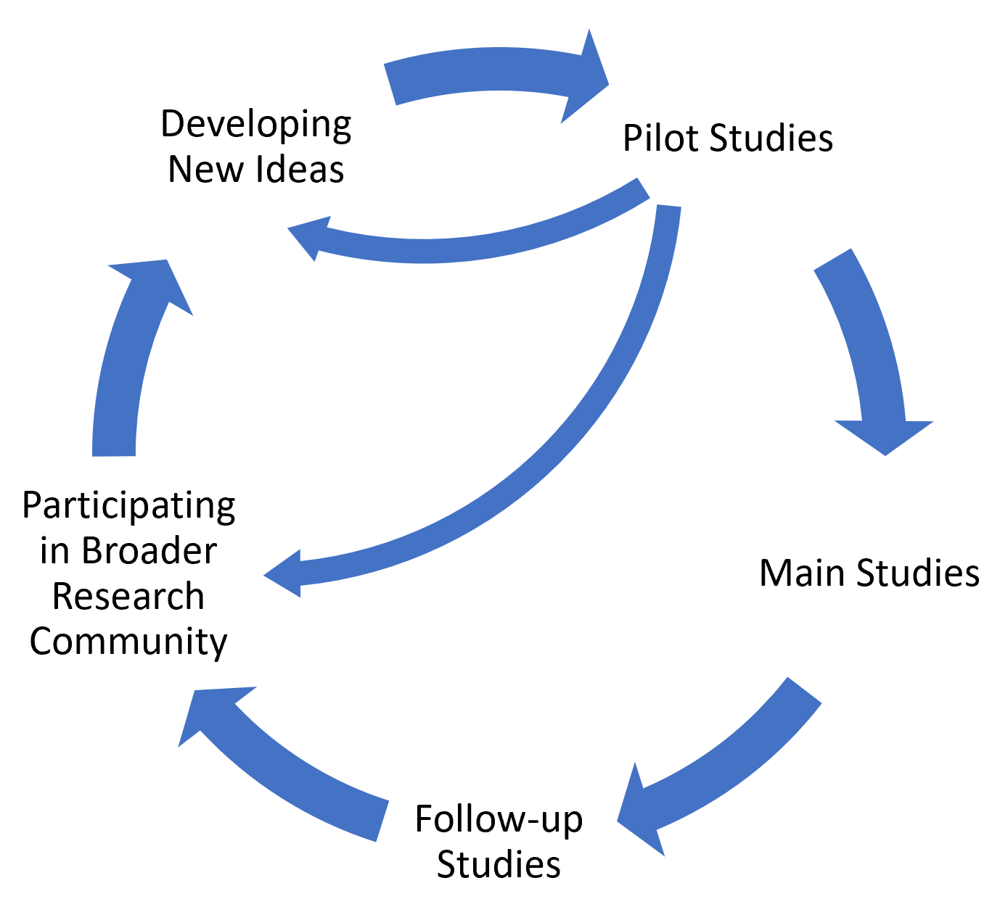

---
output:
  html_document:
    code_folding: show
    toc: yes
    theme: journal
    includes:
        after_body: ../linking_script.html
  pdf_document:
    toc: yes
---

<!--- title: "10 Things to Know About Pilots" -->
<!--- author: 'Authors: Kaylyn Jackson Schiff, Daniel S. Schiff, and Natália S. Bueno' -->

# 1. What is a pilot, and what is it good for?

During the process of planning an experiment, researchers often face questions regarding their study's theoretical and conceptual underpinnings, its measurement approach, and associated logistics. Pilot studies can help you to consider and improve these elements of your research whether you are running a survey, lab, or field experiment. In particular, *a pilot study is a smaller scale preliminary test or trial run, used to assist with the preparation of a more comprehensive investigation*. Pilots are typically administered before a research design is finalized in order to evaluate and improve the feasibility, reliability, and validity of the proposed study.

While it may be tempting to think about a pilot as simply a miniature version of one's final study, helpful for doing an initial test of one's hypotheses, pilot studies are neither especially appropriate for [hypothesis testing](https://egap.org/resource/10-things-to-know-about-hypothesis-testing/){target="_blank"}, nor are they limited to it. Given smaller sample sizes, pilots are typically underpowered for evaluating hypotheses. Besides, deciding whether to continue a study based on initial results contributes to the "file drawer" problem where important studies and results---including [null results](https://egap.org/resource/10-things-your-null-result-might-mean/){target="_blank"}---are never published, leading to misrepresentative bodies of published research [(Franco et al. 2014)](https://science.sciencemag.org/content/345/6203/1502){target="_blank"}.

Fortunately, as depicted in the table below, pilots can be useful for a wide range of research purposes including theory development, research design, improving measurement, sampling considerations, evaluating logistics, pre-planning analysis, weighing ethical considerations, and communicating one's research ([van Teijlingen et al. 2001](https://doi.org/10.1046/j.1365-2648.2001.01757.x.){target="_blank"}; [Thabane et al. 2010](https://doi.org/10.1186/1471-2288-10-1){target="_blank"}). Each of these activities can help improve the quality of one's main study and render it more compelling and ultimately successful. 

In the sections below, we review these many benefits. First, we consider how pilots can assist with a study's theory and measurement approach, evaluate its logistical feasibility, and provide information about the sample size needed to test hypotheses. In addition, we discuss how piloting may help you secure research funding and institutional support, gather feedback, and incorporate best practices in research ethics. Finally, we offer recommendations on how to use pilots to inform your main study design, reveal important unknowns, and contribute to your broader research agenda.

| **Theory Development** | **Research Design** |
|:---:|:---:|
| Refining your research questions and hypotheses | Evaluating suitability of study context for answering research questions |
| Determining initial plausibility of theorized mechanisms | Determining construction and strength of treatments |
| Identifying additional research questions of interest | Determining number, levels, and timing of treatments |
| Exploring unknowns related to your research questions and hypotheses | Considering alternative and/or multiple measures of participant response to treatment |

| **Measurement** | **Sample** |
|:---:|:---:|
| Testing alternative treatments and outcomes to improve clarity, validity, and reliability | Determining power and sample size needed for main study |
| Uncovering issues related to asymmetry in delivery and measurement of treatments and/or outcomes | Evaluating recruitment procedures and eligibility criteria |
| Considering covariate measurement approach | Testing participant understanding of research tools and procedures |
| Ensuring successful data collection and data entry | Assessing participant compliance and treatment uptake |
| Identifying additional information that may need to be collected | Assessing participant response rate, quality, and attrition |
| Considering the use of combined measures such as scales and indices |  |

| **Logistics** | **Analysis** |
|:---:|:---:|
| Determining time and resources needed to conduct main study | Considering feasibility of software, statistical techniques, or other analytic tools given preliminary data |
| Evaluating randomization procedure | Preparing analysis procedures for main study |
| Assessing research team understanding of protocols and procedures | Considering feasibility of incorporating data from partners or other sources |
| Determining partner capacity and willingness | Considering responses to missingness in data |
| Training research team members and partners |  |
| Assessing inter-researcher reliability in data collection, procedures, and analysis |  |

| **Ethics** | **Communicating Research** |
|:---:|:---:|
| Ensuring participant safety and well-being | Collecting preliminary data to share externally |
| Evaluating consent procedures | Soliciting feedback on research design |
| Assessing participant time and burdens | Leveraging pilot results transparently to explain design choices for main study |
| Ensuring normative acceptability of study elements in given context | Demonstrating research team capacity and competence |
| Assessing privacy and confidentiality procedures | Persuading funders, ethics committees, and other stakeholders of study feasibility and value |
| Assessing security of data and other study materials | Informing interested scholars and other stakeholders |
|  | Educating students about research practices |

# 2. Pilots are useful for improving your study’s measurement approach in relation to your theory

Fewer things are more frustrating for a researcher than investing significant resources and time into a study only to find that one's outcome measures lack reliability to accurately assess the concepts of interest, or that participants did not receive treatments in the way that was anticipated. Unexpected results are common, even when one approaches measurement carefully, as operationalizing concepts into an [effective measurement strategy](https://egap.org/resource/10-things-to-know-about-measurement-in-experiments/){target="_blank"} in the social sciences is a complex endeavor.

As a remedy, pilots are great for testing different versions of treatments and outcomes to see which of them "work" or whether any changes may be needed to increase validity, reliability, and clarity. For example, you can include a larger set of outcome measures in a pilot than is feasible in the main study, and perform simple factor analysis to identify a preferred subset of measures. Pilot results can also inform whether it makes sense to create indices or scales in order to improve reliability and decrease variance. Subtle variation in the strength, nature, timing, or number of treatments can also significantly alter study findings. Pilots offer researchers the opportunity to evaluate multiple possibilities for one's treatment design, and to assess how these options influence participant compliance, uptake of treatment, attrition, and more.

When refining one's approach to measuring treatments, outcomes, and covariates, it is especially important to keep in mind how these elements of one's research design speak to the broader concepts and theory under study. Will the data you receive provide the necessary information regarding the theoretical elements and causal mechanisms under study? Are there other causal channels that may be in play, or [heterogeneous effects](https://egap.org/resource/10-things-to-know-about-heterogeneous-treatment-effects/){target="_blank"} within subgroups that you hadn't thought about previously? These kinds of considerations can inform changes to your research design, such as alterations to your [randomization strategy](https://egap.org/resource/10-things-to-know-about-randomization/){target="_blank"}, the introduction of new dimensions in your treatments, and decisions about which aspects of your study are core and which can be saved for a later date.

When you begin a pilot study, you may have an initial conception of your research questions, hypotheses, and measurement approach; but with a careful pilot, you have the opportunity to refine all of these aspects in a way that can increase your (and others') confidence in the overall quality of the study.

# 3. Pilots can also help you to prepare for the logistics of running your experiment

Perhaps the most often emphasized purpose of pilots is to work out any logistical kinks that might impede the main study [(Thabane et al. 2010)](https://doi.org/10.1186/1471-2288-10-1){target="_blank"}. Logistical considerations include those implicating a project's overall resources, the study team, the participants, and the administration of study instruments.

In terms of participant logistics, is important to establish whether your study participants understand the research tools and procedures, are able to receive treatment, and feel comfortable answering questions or performing tasks. Based on how successful the pilot is, you may find ways to improve your recruitment strategy, adjust your eligibility criteria, and improve the clarity of your research instruments. It is also important to ensure that basic elements like randomization and data collection are working as anticipated. Data simulations and pilots with very small samples can also be used to test certain study elements.

Similar considerations apply to your study team and partners. Do they understand the protocols or might they require additional training, for example, to promote reliability in procedures such as data collection? Are there any asymmetries in delivery or measurement of treatment or outcomes of which you were not aware? A pilot can also be very helpful for determining the resources needed to conduct the main study. For example, how much time does it take---for both members of the study team and participants---and what might this imply for the size of the sample and complexity of the research design that is ultimately feasible for the main study?

While the specific logistical considerations will vary depending on whether your research design is centered around a field experiment, survey experiment, lab experiment, or something else, pilots will help you ensure that your experiment goes as planned. Thus, when constructing a pilot study, consider making a list of the logistical elements you want to evaluate and designing the pilot to facilitate answering associated questions. Asking your participants whether they were able to "hear the video" or "understood the instructions" can make your research easier down the road.

# 4. You can use pilots for power analysis or for calculating minimum detectable effects

Another common purpose of pilot studies, in light of limited resources, is assessing [statistical power](https://egap.org/resource/10-things-to-know-about-statistical-power/){target="_blank"}, which helps to avoid the risk of false negatives (or false positives) from underpowered studies. As Coppock (2013) describes in the [EGAP methods guide about power analysis](https://egap.org/resource/10-things-to-know-about-statistical-power/){target="_blank"}, a researcher's goal is to answer the following: "supposing there truly is a treatment effect and you were to run your experiment a huge number of times, how often will you get a statistically significant result?" To improve the likelihood that your main study will achieve a typical target power value of 80%, you can use a pilot study combined with careful simulations. These results are helpful for determining appropriate sample sizes, the extent to which you can subset your sample for various analyses, and whether adjustments may be necessary for increasing power.

Traditionally, a pilot study is used to obtain an estimate of the effect size, which becomes the presumed estimate for simulations used to determine power and sample size in one's main study. However, [DeclareDesign (2019)](https://declaredesign.org/blog/2019-01-23-pilot-studies.html){target="_blank"} cautions that effect size estimates are very noisy in small pilots, especially when true effect sizes are small (for example, under 0.2 sd). As an alternative, they recommend using pilot studies to estimate the standard deviation of the outcome variable. Using this estimate, one can easily obtain an unbiased estimate of a main study's minimum detectable effect (MDE) for a given outcome and with 80% power as 2.8 times the estimated standard error of the associated outcome variable (Gelman and Hill 2006). The goal is to ensure that the MDE is small enough that the study would capture any substantively meaningful effect.

Using the recommendations from DeclareDesign (2019), we provide sample code based on a hypothetical pilot study. In the code below, we assume we have already conducted a pilot study and have calculated the standard deviation of a key outcome measure for both the control and treatment groups. Next, we use these estimates to calculate MDEs for different possible sample sizes, in order to inform our target sample size for a future main study.

```{r echo = T, warning = F, message = F}
require(tidyverse)

#Standard deviations of outcome measure for treatment & control groups calculated from pilot study results
#The ones provided are for purposes of demonstration
#We assume one treatment and control group--you will need to adjust to study specifics
sd_control <- 1.5
sd_treat <- 1.2

#MDE calculation for various possible sample sizes
N <- seq(from=500, to=3000, by=100)
MDE <- vector()
for (i in 1:length(N)){
  #We assume an equal number of participants in treatment and control--you will need to adjust to study specifics
  MDE[i] <- 2.8 * sqrt((sd_control^2/(N[i]/2)) + (sd_treat^2/(N[i]/2))) #The true effect size must be at least 2.8 standard errors from zero to detect it with 80% probability using 95% confidence intervals (Gelman and Hill 2006). To estimate the standard error of the ATE, we use equation 3.6 in Gerber and Green (2012). Thus, simply multiply 2.8 by the standard error of the ATE to calculate the MDE. 
}

#Visualizing results to identify target sample size for main study
mde_data <- as.data.frame(cbind(N, MDE))
mde_plot <- ggplot(mde_data, aes(x=N, y=MDE)) + geom_point() +
  xlab("Sample Size") + ylab("MDE") + ggtitle("Minimum Detectable Effect (MDE) for Main Study by Sample Size") + 
  theme_bw() +
  geom_hline(yintercept = .2, lty = "dashed")
mde_plot
```

Based on the hypothetical standard deviations in the control and treatment groups from the pilot study, the main study would need a sample size of approximately 1,500 to ensure that effect sizes as small as 0.2 sd are detectable. While calculating the MDE based on pilot results is straightforward, determining how small an MDE should be is more subjective, and should be informed by theory and prior work.

MDE calculations are based on the design of the pilot and the specific outcome measures. Thus, you may need to perform MDE calculations for each estimand of interest to determine what sample sizes are needed and which hypotheses can be addressed with sufficient power given your experimental design. Keep in mind that as you use pilot results to refine your study design, including treatments and outcomes, the relevant standard deviations of the outcome measures and the resultant MDE calculations may change. Another quick pilot is an option, though it is important to take resource constraints into account.
 
# 5. Piloting may help you secure funding and support for your research

Pilots are not only helpful for improving the quality of your main study, they may also help to ensure you have the support and funding to enable your study to go forward. Given a general trend of tightening of per-researcher funding, particularly for smaller projects [(Bloch and Sørensen 2015)](https://doi.org/10.1093/scipol/scu019){target="_blank"}, and a movement towards evidence-based decision-making, you may wish to draw on pilots to provide initial evidence that your study is worthwhile. For example, the National Science Foundation (NSF) recognizes the need for more early-stage exploratory studies that can provide a basis for future larger-scale studies, and [Time-sharing Experiments for the Social Sciences (TESS)](https://www.tessexperiments.org/){target="_blank"} notes that "Proposals that report trial runs of novel and focal ideas will be viewed as more credible." 

This does not entail that one needs to show that effect sizes are large enough nor that hypotheses are likely to be confirmed. Instead, a pilot can demonstrate that your research project is feasible in terms of time and resources, that your study design is adequate for answering the research questions proposed, and that your research team has the expertise and capacity to administer the study, perform analyses, and even present results in a compelling fashion [(van Teijlingen et al. 2001)](https://doi.org/10.1046/j.1365-2648.2001.01757.x){target="_blank"}. In a similar fashion, piloting can help you to recruit study team members and organizational partners, or solicit institutional support.

# 6. You can use a pilot to get feedback on your study design

Sharing initial findings, successes, and challenges is a great way to help you prepare for your main study. In light of the growth of the open science movement [(Christensen et al. 2020)](https://escholarship.org/uc/item/0hx0207r){target="_blank"}, conferences and workshops are increasingly open to accepting submissions based on pre-analysis plans and pilot results. Whether through these more formal venues, or by reaching out to colleagues or experts, you can use pilot results to receive feedback about your study design, such as strategies to address possible challenges and unexplored theoretical or empirical directions that you can incorporate in your main study. 

Further, it can take a long time to complete an experimental study and publish results. Sharing intermediate findings allows you to coordinate with other researchers in the field, helping you to align your work and incorporate recent theoretical and empirical innovations relevant to your study.

Ultimately, the design and piloting stage is the **best** time to receive feedback, as you still have time to make improvements. In contrast, most key research design decisions will already have been finalized by the time your study undergoes formal peer review for publication.

# 7. Keep an eye out for ethical considerations when piloting

When you design your study initially, all of the relevant [ethical considerations](https://egap.org/wp-content/uploads/2020/05/egap-committee-memo-on-the-report-of-the-apsa-ad-hoc-committee-on-human-subjects-research.pdf){target="_blank"} and risks may not be immediately apparent. The piloting stage is thus a good opportunity to review whether any risks or harms you anticipated may come into play and whether still other ethical considerations should be incorporated into your main study.

You can use your pilot to evaluate whether your procedures around informed consent are adequate and to assess the extent of burdens such as time required of participants. You may find, for example, that certain topics---such as mental health and personal identity---are more sensitive than anticipated, or that survey questions (even those based on validated and popular measures) use outdated and offensive language. The best way to find out is to ask. Consider including open-ended survey questions or talking to participants directly to determine what participants think of the study in terms of its normative and cultural acceptability in a given context.

In addition, the piloting process is a good time to practice your procedures around privacy, confidentiality, and security of data and other materials. You may find that other procedures for obtaining consent, ensuring participant safety and well-being, and promoting privacy and anonymity are necessary to improve the ethical dimensions of your main study. This can include decreasing risks as well as increasing benefits to participants, such as by providing helpful resources and information that may help to mitigate possible harms.

Note that this doesn't imply any less ethical consideration should be given to your pilot itself. All appropriate safeguards, including IRB review, apply to human subjects research for a pilot study as well.


# 8. Be transparent about how your pilot informs the design of your main study

As noted, it's helpful to pre-identify a set of questions about logistics, measurement, or other features of your study that you believe a pilot can help to answer. Putting these questions into writing, designing your pilot to facilitate answering them, and reporting on how the answers shape any modifications to your main study is a way in which you can promote transparency in research. This includes transparency *within* one's study team about the purposes of a pilot, as well as for external audiences such as funders or peer reviewers. Transparency helps to alleviate concerns such as the file drawer problem, for example by demonstrating that a pilot study does not function as a method for cherry-picking statistically significant results. It also facilitates understanding and receipt of feedback.

The table below is a simple illustrative example of how one could transparently present lessons learned from a hypothetical pilot, for example, in a pre-analysis plan or research proposal. The first column indicates the question the pilot is intended to help answer, in this case questions related to logistical adequacy, manipulation checks, delivery of treatments, and measurement of outcomes. The second column presents the associated findings from the pilot, and the third column discusses how the lessons learned will inform design choices for the main study. 

| **Questions** | **Pilot Results** | **Design Decision** |
|:---:|:---:|:---:|
| Can participants hear the video treatments? | 10% reported difficulty. | We will add subtitles to the video treatments. |
| Can participants identify the politician party, indicating successful treatment? | 75% correctly identified the politician party. | We will mention the politician party additional times to make this treatment component more memorable to participants. |
| Which video treatments from the available options are best to use? | Participants were more familiar with some politicians in the videos than others. | We will randomize subjects to a more familiar or less familiar politician and may explore heterogeneous effects by politician familiarity. |
| What is the best way to measure uncertainty as an outcome? | Respondents appear to have been confused by bidirectional scales and questions with reversed scales. | We will use unidirectional scales and also consider the distribution (variance) of other key outcome measures. |

# 9. Explore unknowns

While you may begin your study with a set of preestablished questions---or "known unknowns"--- that your pilot can help to address, keep in mind that there is a whole universe of "unknown unknowns" left to be explored. Of course, not all of these will be relevant to your study, but some are likely to be. For example, you may find that the participants have vastly different interpretations of an informational treatment, understand survey scales differently, or are reluctant to share responses given a perceived political bias.

There are a few ways to explore these unknowns in your pilot study. You might wish to include additional exploratory outcome questions, collect extra covariate data, or use a variety of treatments drawing on innovative or untested ideas. Another great way to identify unknowns is through open-ended questions of study participants. Regardless of your study design, you might consider surveying or interviewing participants to ask "what they think about topic X," or "what comes to mind when they hear the term Y." The world is often more complex than researchers model in their study designs, and study participants often have more diverse perspectives and relationships with the issues at hand than researchers expect. 

Through this process, you may identify novel research questions, potential theoretical dimensions or causal mechanisms, and hypotheses that you had not originally formulated when you began studying the topic. Exploring unknowns can therefore lead to refining the ideas you had originally conceived of, as you are unlikely to have determined the best version of your study from the beginning. It can also lead to entirely novel considerations and ideas altogether, some of which you may be able to incorporate into the current study or future studies.

Overall, pilots afford a wonderful opportunity for open-ended exploration and idea generation.

# 10. A pilot is part of a broader sequence of research activities

While we've talked about research in terms of "pilots" and "main studies," this is an oversimplification of the research process. Indeed one can (and often should) employ multiple pilot studies, perhaps with different sample sizes, to evaluate different questions and to continue refining one's research design as new questions and possibilities emerge. Pilot studies certainly do set the stage for main studies as well as subsequent "follow-up" studies, but there may not be a sharp demarcation between these kinds of studies. As depicted in the graphic, pilot studies do not merely lead to main studies. They can also help one develop new ideas and they may serve as a venue through which one can contribute to or coordinate with the broader research community around topics of shared interest. 


<center>
{width=50%} 
</center>
<!--We can share if you are able to upload the image to the EGAP website.-->

As pilots are part of this broader sequence of research activities, an important consideration is what portion of one's funding and resources should be allocated to a pilot study versus one's main study. Researchers may be discouraged from devoting research resources to pilots due to a perception that pilots only provide preliminary data that cannot be used for final research products. While there is no simple "rule of thumb" about the share of the budget that researchers should apply to pilots, we believe that pilots can pay off when they empower researchers to improve their study designs and make more grounded decisions about their research. 

Administering a second pilot study is especially prudent when pilot results or procedures deviate significantly from your expectations, or if you make substantial alterations to your design. Piloting one or more times is particularly beneficial for field experiments, as researchers often have just one opportunity to successfully implement their full study. However, when resources are constrained, you may opt instead to use simulations to evaluate alternative research designs based on results from your single pilot study. The  [DeclareDesign](https://declaredesign.org/){target="_blank"} package in R is a helpful resource.

In short, pilots are neither pre-tests of hypotheses nor merely checks on basic study logistics that deplete one's research funds. Instead, pilots are living and breathing elements of the broader research process that provide value in their own right.

# Bibliography
Bloch, Carter, and Mads P. Sørensen. 2015. “The Size of Research Funding: Trends and Implications.” *Science and Public Policy* 42 (1): 30–43. [https://doi.org/10.1093/scipol/scu019](https://doi.org/10.1093/scipol/scu019){target="_blank"}

Christensen, Garret, Zenan Wang, Elizabeth Levy Paluck, Nicholas Swanson, David Birke, Edward Miguel, and Rebecca Littman. 2020. “Open Science Practices Are on the Rise: The State of Social Science (3S) Survey.” 106. Working Paper Series. *Center for Effective Global Action, University of California*. [https://escholarship.org/uc/item/0hx0207r](https://escholarship.org/uc/item/0hx0207r){target="_blank"}

DeclareDesign. 2019. “Should a Pilot Study Change Your Study Design Decisions?” *DeclareDesign*. 
[https://declaredesign.org/blog/2019-01-23-pilot-studies.html](https://declaredesign.org/blog/2019-01-23-pilot-studies.html){target="_blank"}

Franco, Annie, Neil Malhotra, and Gabor Simonovits. 2014. “Publication Bias in the Social Sciences: Unlocking the File Drawer.” *Science* 345 (6203): 1502–5. https://doi.org/10.1126/science.1255484.

Gelman, Andrew, and Jennifer Hill. 2006. *Data Analysis Using Regression and Multilevel/Hierarchical Models*. Cambridge, United Kingdom: Cambridge University Press.

Gerber, Alan S., and Donald P. Green. 2012. *Field Experiments: Design, Analysis, and Interpretation*. 1st ed. New York, New York: W. W. Norton.

Thabane, Lehana, Jinhui Ma, Rong Chu, Ji Cheng, Afisi Ismaila, Lorena P. Rios, Reid Robson, Marroon Thabane, Lora Giangregorio, and Charles H. Goldsmith. 2010. “A Tutorial on Pilot Studies: The What, Why and How.” *BMC Medical Research Methodology* 10 (1): 1-10. [https://doi.org/10.1186/1471-2288-10-1](https://doi.org/10.1186/1471-2288-10-1){target="_blank"}

van Teijlingen, Edwin R., Anne-Marie Rennie, Vanora Hundley, and Wendy Graham. 2001. “The Importance of Conducting and Reporting Pilot Studies: The Example of the Scottish Births Survey.” *Journal of Advanced Nursing* 34 (3): 289–95. [https://doi.org/10.1046/j.1365-2648.2001.01757.x.](https://doi.org/10.1046/j.1365-2648.2001.01757.x.){target="_blank"}


