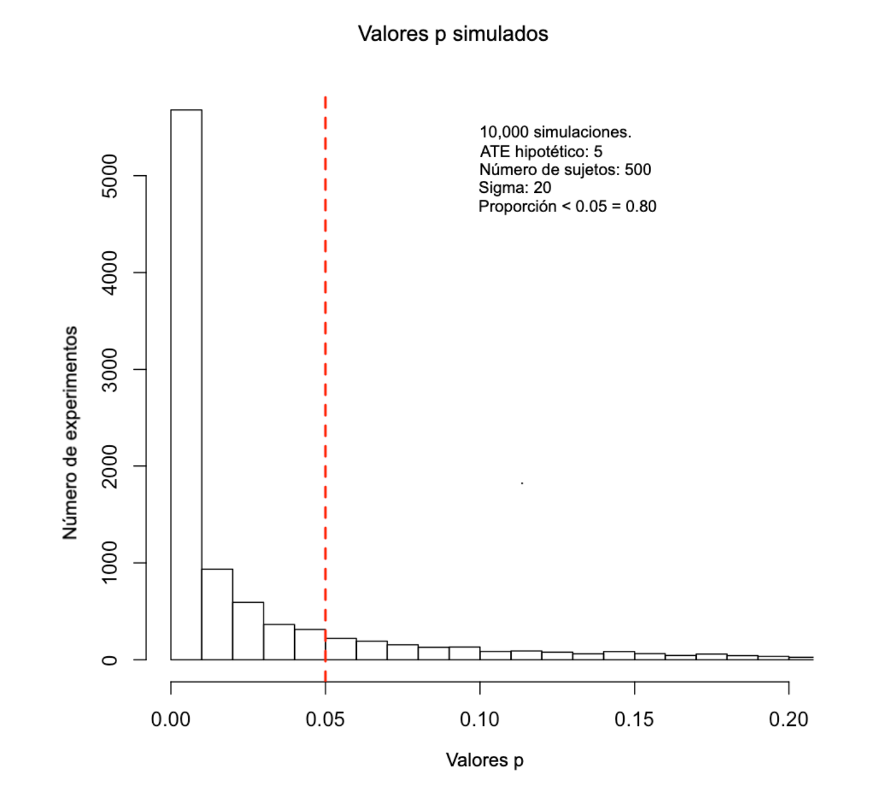

---
output:
  html_document:
    toc: yes
    theme: journal
    includes:
        after_body: ../linking_script.html
---

<!-- title: "10 Things You Need to Know About Statistical Power" -->
<!-- author: 'Methods Guide Author: Alexander Coppock' -->

Resumen
==

Esta guía[^1] es un herramienta que le servirá para evaluar y mejorar el poder de sus experimentos. Nos enfocaremos  en ideas generales y presentaremos ejemplos y herramientas que puede utilizar en R y Google Spreadsheets.

[^1]: Autor original: Alex Coppock, 20 de noviembre de 2013. Esta guía es un documento dinámico y por lo tanto puede ser modificada por los miembros de EGAP en cualquier momento. Coppock no se hace responsable de las ediciones posteriores de esta guía.


1 Qué es el poder estadístico
==

El poder estadístico sirve para diferenciar la señal del ruido.

La señal en la que estamos interesados es el impacto de un tratamiento sobre alguna variable de resultado. ¿Podemos decir que entre más alto nivel de educación mayor el ingreso? ¿Reducen las campañas de salud pública la incidencia de enfermedades? ¿Puede el monitoreo internacional disminuir la corrupción gubernamental?


El ruido que nos importa proviene de la complejidad del mundo. Las variables de resultado varían según las personas y los lugares por innumerables razones. En términos estadísticos, puede pensar en esta variación como la desviación estándar de la variable de resultado. Por ejemplo, suponga que para un experimento, la variable de resultado que nos interesa es la tasa de una  enfermedad rara. Es poco probable que el número total de personas afectadas fluctúe mucho día a día, lo que significa que el ruido de fondo en este caso sería bajo. Cuando el ruido es bajo, los experimentos pueden detectar incluso cambios  pequeños en la variable de resultado promedio. Un tratamiento que reduzca la incidencia de la enfermedad en un 1% en puntos porcentuales se detectaría fácilmente, porque las tasas de referencia son  constantes.

Ahora suponga que en un experimento se utiliza el ingreso de los sujetos como variable de resultado. El nivel de ingresos pueden variar mucho; no es raro que en algunos lugares las personas tengan vecinos que ganan dos, diez o cien veces el valor de su salario diario. Cuando el ruido es alto, tenemos mayores dificultades para detectar cambios. Un tratamiento que incremente los ingresos de los trabajadores en un 1% sería difícil de detectar, porque los ingresos difieren mucho en primer lugar.

Una de las principales preocupaciones antes de embarcarse en un experimento es el peligro de un __falso negativo__. Suponga que el tratamiento realmente tiene un impacto causal en los resultados. Sería una pena tomarse todas las molestias y los gastos de aleatorizar el tratamiento, recopilar datos sobre los grupos de tratamiento y de control y analizar los resultados, solo para que el efecto se vea abrumado por el ruido de fondo.

Si nuestros experimentos tienen suficiente poder, podemos estar seguros de que si realmente hay un efecto del tratamiento, seremos capaces de observarlo.

2 ¿Por qué es importante?
==
A menudo los investigadores experimentales buscan evitar el riesgo de falsos positivos utilizando pruebas de significancia estadística. Después de que se ha realizado un experimento, nos preocupa concluir falsamente que hay un efecto cuando en realidad no lo hay.

El análisis de poder plantea la pregunta opuesta: suponiendo que realmente haya un efecto de tratamiento y que se pueda realizar el experimento muchas veces, ¿con qué frecuencia obtendría un resultado estadísticamente significativo?

Responder a esta pregunta requiere hacer supuestos informados. Supuestos razonables sobre qué tan grande puede ser el efecto de su tratamiento, cuántos sujetos responderán su encuesta, cuántos temas puede su organización permitirse tratar de manera realista.

¿En qué nos basamos para hacer estos supuestos? Antes de ejecutar un experimento, a menudo hay una gran cantidad de datos disponibles. ¿Qué edad/ riqueza/educación van a tener los sujetos en el experimento? ¿Cuál es el efecto establecido más grande que  su tratamiento ha tenido sobre la variable dependiente? Con ayuda del análisis de poder, puede ver qué tan sensible es la probabilidad de obtener resultados significativos a cambios en los supuestos.

Muchas disciplinas consideran 0.80 como un poder estadístico ideal. Los investigadores modifican sus diseños y supuestos hasta estar seguros que sus experimentos arrojarán resultados estadísticamente significativos el 80% de las veces. Si bien esta convención es un punto de referencia útil, asegúrese de sentirse cómodo con los riesgos asociados a una tasa de éxito esperada del 80%.

Nota de precaución: el poder es muy importante. Los resultados negativos de estudios con poco poder pueden ser difíciles de interpretar: ¿realmente no hay ningún efecto? ¿O el estudio simplemente no puede detectarlo? Los resultados positivos de un estudio con poco poder también pueden ser engañosos: asumiendo que  el efecto sea estadísticamente significativo, una estimación de un estudio con poco poder probablemente sobrestima los efectos del tratamiento. Los estudios con poco poder se basan a veces en supuestos demasiado optimistas; un análisis de poder convincente hace que estas suposiciones sean explícitas y debería protegerlo de la implementación de diseños que, de manera realista, no tienen ninguna posibilidad de responder a las preguntas que desea responder.


3 Los tres ingredientes del poder estadístico
==
Hay tres grandes categorías de cosas que determinan el poder de un experimento. Las dos primeras (la efectividad del tratamiento y el ruido de fondo) son cosas que realmente  no se pueden controlar; estas son las realidades del entorno experimental. El último, el diseño experimental, es lo único sobre lo se que tiene poder: ¡úselo!

* Efectividad del tratamiento. A medida que aumenta la efectividad de un tratamiento, aumenta el poder del experimento. Esto tiene sentido: si el tratamiento le diera a cada sujeto $1,000,000, no hay duda de que podríamos identificar diferencias en el comportamiento entre los grupos de tratamiento y control. Sin embargo, muchas veces no controlamos la efectividad del tratamiento. Por ejemplo, los investigadores que participan en la evaluación de un programa no pueden decidir cuál debería ser el tratamiento, se espera que evalúen el programa tal como es.

* Ruido de fondo. A medida que aumenta el ruido de fondo de las variables de resultado, disminuye el poder del experimento. En la medida de lo posible, intente seleccionar variables de resultado que tengan baja variabilidad. En términos prácticos, esto significa comparar la desviación estándar de la variable de resultado con el tamaño del efecto del tratamiento esperado; no hay una proporción mágica que deba buscar, pero cuanto más cerca estén las dos cantidades, mejor será su experimento. En general, los investigadores no tienen el control del ruido de fondo y no siempre es tan fácil seleccionar variables de resultado con poco ruido. Además, muchas variables de resultado en las que podemos estar interesados tienen una variabilidad intrínseca alta. Desde esta perspectiva, el ruido de fondo es algo con lo que se debe lidiar de la mejor forma posible.

* Diseño experimental. El análisis de poder tradicional se centra en un elemento (muy importante) del diseño experimental: el número de sujetos en cada grupo experimental. En pocas palabras, entre más sujetos más poder. Sin embargo, hay otros elementos del diseño experimental que pueden aumentar el poder: ¿cómo se realiza la asignación aleatoria? ¿Se controlarán estadísticamente otros factores? ¿Cuántos grupos de tratamiento habrá y pueden ser estos combinados para algunos análisis?

4 Fórmulas clave para calcular el poder
==
Los estadísticos han derivado fórmulas para calcular el poder de muchos diseños experimentales. Estas pueden resultar útiles para calcular el tamaño de muestra necesaria para detectar un efecto. Sin embargo, tenga cuidado, porque los supuestos detrás de las fórmulas a veces pueden ser poco claros y, lo que es peor, pueden ser erróneos.

A continuación, presentamos una fórmula común que se usa para calcular el poder[^2]

[^2]: Reproducido de Gerber y Green 2012, página 93


$$\beta = \Phi \left(\frac{|\mu_t-\mu_c|\sqrt{N}}{2\sigma}-\Phi^{-1} \left(1-\frac{\alpha}{2}\right) \right)$$

* $\beta$ es nuestra medida de poder. Debido a que es la probabilidad de obtener un resultado estadísticamente significativo, $\beta$ es un número entre 0 y 1.
* $\Phi$ es la CDF de la distribución normal y $\Phi^{-1}$ es su inversa. Para todo lo demás en esta fórmula, tenemos que reemplazar valores:
* $\mu_t$ es la variable de resultado promedio en el grupo de tratamiento. Supongamos que es 65 años.
* $\mu_c$ es la variable de resultado promedio en el grupo de control. Supongamos que es 60.
* En conjunto, las suposiciones sobre $\mu_t$ y $\mu_c$ definen nuestros supuestos sobre el tamaño del efecto del tratamiento: 65-60 = 5.
* $\sigma$ es la desviación estándar de los resultados. Así es como contruímos nuestros supuestos sobre qué tan ruidoso será nuestro experimento: uno de los supuestos que estamos haciendo es que sigma es el mismo para los grupos de tratamiento y control. Suponga $\sigma = 20$
* $\alpha$ es nuestro nivel de significancia; la convención en muchas disciplinas es que $\alpha$ debe ser igual a 0,05. $N$ es el número total de sujetos. Esta es la única variable que está bajo el control directo del investigador. Esta fórmula asume que cada sujeto tiene una probabilidad de 50/50 de ser asignado al grupo de control. Suponga que $N = 500$.

Si observamos la fórmula con detenimiento, encontramos que bajo estos supuestos $\beta = 0.80$, lo que significa que tenemos una probabilidad del 80%  de obtener un resultado estadísticamente significativo con este diseño. Haga clic en [aquí para acceder a una hoja de cálculo de Google](https://docs.google.com/spreadsheets/d/117R4cqKkhX1MFqPIh7Yg2YzjHykxD7WsSLXqhEbD33I/edit#gid=0) {target = "_blank"} con esta fórmula. Puede copiar estas fórmulas directamente en Excel. Si se siente cómodo con R, aquí hay un código que le ayudará hacer el mismo cálculo.


```{r, message=FALSE, warning=FALSE, error=FALSE}
power_calculator <- function(mu_t, mu_c, sigma, alpha=0.05, N){ 
  lowertail <- (abs(mu_t - mu_c)*sqrt(N))/(2*sigma) 
  uppertail <- -1*lowertail 
  beta <- pnorm(lowertail- qnorm(1-alpha/2), lower.tail=TRUE) + 1- pnorm(uppertail- qnorm(1-alpha/2), lower.tail=FALSE) 
  return(beta) 
  } 
```

5 Cuándo confiar en el análisis de poder 
==
Desde una perspectiva, puede que toda la idea del análisis del poder no tenga sentido. Estamos interesados averiguar el tamaño de algún efecto del tratamiento, pero primero necesitamos hacer un análisis de poder, lo que requiere que ya conozcamos el efecto del tratamiento y mucho más.

Entonces, en la mayoría de los análisis de poder estamos viendo lo que sucedería asumiendo algunos números que hasta cierto punto son inventados. La buena noticia es que es fácil averiguar cuánto dependen nuestras conclusiones de los supuestos: simplemente tenemos que variar nuestros supuestos y observar cómo varían las conclusiones en relación al poder.

Es más fácil ver esto si pensamos cómo varía el poder con el número de sujetos. Un análisis de poder que analiza el poder para diferentes tamaños de estudio simplemente conecta un rango de valores para N y observa cómo cambia $\beta$.

Usando la fórmula que vimos en la sección 4, podemos ver qué tan sensible es el poder a todas los supuestos: El poder será mayor si asume que el efecto del tratamiento será mayor, o si está dispuesto a aceptar un nivel alfa más alto, o si tiene más o menos confianza en el ruido de sus medidas. [^3]


[^3]: Puede encontrar una herramienta visual para el cálculo del poder en Kristoffer Magnusson's [R Psychologist blog](http://rpsychologist.com/d3/NHST/){target="_blank"}.

<iframe height="500" src="https://egap.shinyapps.io/Power_Calculator/" width="850"></iframe>

6  Cómo  las simulaciones nos puede ayudar a estimar el poder
==
El poder es una medida de la frecuencia con la que, dados nuestros supuestos, obtendríamos resultados estadísticamente significativos si lleváramos a cabo nuestro experimento miles de veces. Para la fórmula del cálculo del poder hacemos ciertos supuestos y obtenemos una solución analítica. Sin embargo, gracias a los avances informáticos, no tenemos que depender de soluciones analíticas para el análisis del poder. Podemos decirle a nuestras computadoras que realicen el experimento miles de veces y simplemente establecer la frecuencia con la que nuestro experimento resulta significativo.

El código a continuación muestra cómo realizar esta simulación en R


```{r, message=FALSE, error=FALSE, warning=FALSE}
# Los tamaños de muestra a considerar
possible.ns <- seq(from=100, to=2000, by=40) 
 ## requerimos que el tamaño de la muestra sea par
stopifnot(all( (possible.ns %% 2)==0 ))
powers <- rep(NA, length(possible.ns)) # Vector vacío para almacenar los ns
alpha <- 0.05 # Nivel de significancia estándar
sims <- 500 # Número de simulaciones para cada n
#### Ciclo exterior que varia el número de sujetos #### 
for (j in 1:length(possible.ns)){ N <- possible.ns[j] 
  # resultado potencial del grupo de control
  Y0 <- rnorm(n=N, mean=60, sd=20) 
  tau <- 5 # Efecto del tratamiento hipotético
  Y1 <- Y0 + tau  # resultado potencial del grupo de tratamiento   
  # Vector vacío para almacenar la cantidad de experimentos significativos
  significant.experiments <- rep(NA, sims) 
                                  
#### Ciclo interno para realizar experimentos "sims" veces por cada N ####
  #  resultado potencial grupo de control
  Y0 <- rnorm (n = N, mean = 60, sd = 20) 
  tau <- 5 # efecto del tratamiento hipotético
  Y1 <- Y0 + tau # resultado potencial del grupo de tratamiento

  for (i in 1:sims){ 
        ## Z.sim <- rbinom(n=N, size=1, prob=.5) # Asignación aleatoria con lanzamiento de moneda
       ## asignación aleatoria asegurando grupos de igual tamaño
        Z.sim <- sample(rep(c(0,1),N/2))
         # Revelar resultados según la asignación
        Y.sim <- Y1 * Z.sim + Y0 * (1-Z.sim)
        fit.sim <- lm (Y.sim ~ Z.sim) # Análisis (regresión simple) 
        p.value <- summary(fit.sim)$coefficients[2,4] # Extraer valores p 
        # Determinar la significancia con p <= 0.05
        significant.experiments[i] <- (p.value <= alpha) 
  }
  #  almacenar la tasa de éxito promedio (poder) para cada N
  powers[j] <- mean(significant.experiments) 
  } 
powers 
```

El código para esta simulación y otras está disponible [aquí](https://egap.org/resource/script-power-analysis-simulations-in-r/) {target = "_blank"}. La simulación es una forma mucho más flexible e intuitiva de pensar el análisis de poder. Incluso los ajustes más pequeños a un diseño experimental son difíciles de capturar en una fórmula (agregar un segundo grupo de tratamiento, por ejemplo), pero son relativamente sencillos de incluir en una simulación.

Además de contar la frecuencia con la que sus experimentos resultan estadísticamente significativos, puede observar directamente la distribución de los valores p que son probables de obtener. El siguiente gráfico  muestra que bajo estos supuestos, se puede esperar obtener unos cuantos valores p en el rango de 0.01, pero ese 80% estará por debajo de 0.05.

  


7 Cómo modificar el diseño de un experimento para mejorar el poder
==

Cuando de poder estadístico se trata, sobre lo único que tenemos control es el diseño del experimento. Como ya vimos anteriormente, una elección de diseño obvia es el número de unidades  en el experimento. Entre más unidades, mayor  el poder

Sin embargo, el número de unidades no es la única opción del diseño del experimento que tenemos para mejorar el poder. Hay dos opciones que son especialmente importantes para esto.

* Elección de estimador. ¿Está utilizando una diferencias de medias? ¿Hará alguna transformación, como un logit o un probit? ¿Controlará las covariables? ¿Utilizará algún tipo de estimador de error estándar robusto? Todas estas opciones marcarán la diferencia en la importancia estadística de sus resultados y, por lo tanto, en el poder de su experimento. Una forma fácil de pensar en esto es imaginar qué comando ejecutará en R o Stata después de  realizar experimentoo; ¡ese es su estimador!

* Protocolo de aleatorización. ¿Qué tipo de aleatorización utilizará? La aleatorización simple asigna la misma probabilidad a todos los sujetos de estar en el grupo de tratamiento y luego lanza una moneda (que puede estar desbalanceada) para decidir la asignación de cada sujeto. La aleatorización completa es similar, pero garantiza que se asigne exactamente un determinado número de sujetos al tratamiento. La aleatorización en bloques es aún más poderosa: asegura que un cierto número dentro de un subgrupo sea asignado al tratamiento. Una asignación aleatoria restringida rechaza algunas asignaciones aleatorias de acuerdo a ciertos criterios; por ejemplo, falta de balance entre grupos. Estos diversos tipos de asignación aleatoria pueden aumentar drásticamente el poder de un experimento de un experimento sin costo adicional. Lea sobre los protocolos de aleatorización [aquí](http://egap.org/resource/10-cosas-que-debe-saber sobre-la-aleatorizacion).

Son demasiadas opciones como para poderlas cubrir en este breve artículo, pero el lector podrá consultar la página de códigos de Simulation for Power Analysis para que tenga algunas ideas de cómo comenzar. Pero para se pueda llevar una idea  de cómo abordar el análisis de poder desde la simulación, considere cómo realizaría un análisis de poder si quisiera incluir covariables en su análisis.

Si las covariables que incluye como variables de control están fuertemente relacionadas con la variable de resultado, entonces ha aumentado drásticamente el poder de su experimento. Desafortunadamente, el poder adicional que viene con la inclusión de variables de control es muy difícil de capturar en una fórmula compacta. Casi ninguna de las fórmulas de poder que encontramos en los libros de texto o que circulan en internet puede proporcionar una guía sobre lo que la inclusión de covariables puede hacer por el poder.

La simulación es la respuesta.

* Supongamos que estamos estudiando el efecto que tiene una intervención educativa sobre los ingresos.
* Suponga que tenemos buenos datos sobre la relación entre dos covariables y el ingreso: edad y género. En esta economía, los hombres ganan más que las mujeres y las personas mayores ganan más que los más jóvenes.
* Corra una regresión tomando a los ingresos como variable dependiente y la  edad y sexo como variables dependientes y registre los coeficientes. Utilice datos de encuestas preexistentes (mejor aún: ¡use datos de referencia (baseline) de futuros participantes de su experimento!) 
* Genere datos de covariables falsos: N total de sujetos, pero desglosados por edad y sexo de una manera que refleje su grupo de sujetos experimentales.
* Genere datos de control falsos, donde el resultado es una función de la edad y el género de acuerdo con sus estimaciones de regresión
* Hipotetizar un efecto de tratamiento para generar datos falsos del tratamiento
* Ejecute el experimento 10,000 veces y registre con qué frecuencia, utilizando una regresión con controles, su experimento resulta significativo.

A continuación, presentamos un gráfico que compara la eficacia de un experimento que controla las covariables de contexto con uno que no lo hace. El  R cuadrado  de la regresión que relaciona los ingresos con la edad y el género es bastante alto, alrededor de .66, lo que significa que las covariables que hemos reunido (generado) son altamente predictivas. Para una comparación aproximada, sigma, el nivel del  ruido que el modelo no ajustado maneja, es alrededor de 33. Este gráfico muestra que en cualquier N, el modelo ajustado por covariables tiene más poder, tanto que el modelo no ajustado necesitaría 1500 sujetos para lograr lo que el modelo ajustado con covariables puede hacer con 500.


Este enfoque no se basa en una fórmula para generar la probabilidad de obtener un resultado estadísticamente significativo: ¡es fuerza bruta! Y debido a que la simulación le permite especificar cada paso del diseño experimental, hace un análisis de poder mucho más matizado que simplemente considerar el número de sujetos.

8 Análisis de poder para múltiples tratamientos
==
Muchos experimentos emplean múltiples tratamientos que se comparan entre sí y con un grupo de control. Esta complicación adicional cambia lo que queremos decir cuando decimos el "poder" de un experimento. En el caso de un solo grupo de tratamiento, el poder es solo la probabilidad de obtener un resultado estadísticamente significativo. En el caso de tratamiento múltiple, puede significar una variedad de cosas: A) la probabilidad de que al menos uno de los tratamientos resulte significativo, B) la probabilidad de que todos los tratamientos resulten significativos (frente al control) o C) la probabilidad de que los tratamientos se clasifiquen en un orden hipotético y que esos rangos sean estadísticamente significativos.

La pregunta sobre los múltiples brazos de tratamiento está relacionada con el problema de las compraciones múltiples. La prueba de significancia estándar se basa en la premisa de que está realizando una sola prueba de significancia estadística, y los valores p derivados de estas pruebas reflejan la probabilidad bajo la hipótesis nula de ver un efecto de tratamiento tan grande (o más grande). Sin embargo, si está realizando varias pruebas, esta probabilidad ya no es correcta. Dentro de un conjunto de pruebas, la probabilidad de que al menos una de las pruebas resulte significativa incluso cuando el efecto real es cero es mayor, esencialmente porque tiene más intentos. Una solución comúnmente citada (si no es que usada comúnmente) es usar la corrección de Bonferroni: especificando el número de comparaciones que hará por adelantado y luego dividiendo su nivel de significancia (alfa) por ese número.

Si va a utilizar una corrección de Bonferroni, las calculadoras de potencia estándar serán más complicadas de usar: tendrá que especificar sus niveles alfa corregidos usando Bonferroni y calcular el poder de cada comparación por separado. Para calcular la probabilidad de que todas las pruebas sean significativas, multiplique todos los valores de los poderes juntos. Para calcular la probabilidad de que al menos una de las pruebas sea significativa, calcule la probabilidad de que ninguna prueba lo sea y luego réstele esa cantidad a uno.

O puede utilizar la simulación. Un ejemplo de un cálculo de poder realizado en R está disponible en la página de simulaciones.


9 Cómo pensar el poder para diseños por conglomerados
==

Cuando un experimento tiene que asignar a grupos enteros de personas al tratamiento en lugar de individualmente, decimos que el experimento es por conglomerados. Esto es común en experimentos educativos, donde aulas enteras de niños se asignan al tratamiento o control, o en la economía del desarrollo, donde aldeas enteras de individuos se asignan al tratamiento o al control.

Como regla general, los conglomerados reducen el poder. Por lo tanto, de ser posible, es preferible evitar el uso de conglomerados. A menos que enfrente preocupaciones relacionadas con efectos de derrame, la logística o la ética, lleve la variación al nivel más bajo posible.

El mejor escenario para un diseño a nivel de conglomerado es cuando el conglomerado en el que se encuentra un sujeto proporciona muy poca información sobre sus variables de resultado. Suponga que los sujetos fueron asignados aleatoriamente al conglomerado; el conglomerado no ayudaría en absoluto a predecir los resultados. Si el conglomerado no predice el resultado, entonces no hemos perdido demasiado poder por los conglomerados.

Donde la agrupación por conglomerados  causa realmente problemas es cuando existe una fuerte relación entre el conglomerado y la variable de resultado. Para continuar con el ejemplo de las aldeas, supongamos que algunas aldeas son, en conjunto, mucho más ricas que otras. Entonces, los conglomerados podrían predecir bastante los logros educativos. La agrupación por conglomerados puede reducir el tamaño de muestra efectivo del número total de individuos al número total de conglomerados.

Hay fórmulas que pueden ayudarlo a comprender las consecuencias de los conglomerados; consulte Gelman / Hill en las páginas 447-449 para una discusión más extensa. Si bien estas fórmulas pueden ser útiles, también puede resultar bastante engorroso trabajar con ellas. Sin embargo, la idea central es simple: generalmente se obtiene más poder al aumentar el número de grupos que al aumentar el número de sujetos dentro de los grupos. Es mejor tener 100 grupos con 10 sujetos en cada uno que 10 grupos con 100 sujetos en cada uno.

Una vez más, un enfoque más flexible para el análisis de poder cuando se trata de conglomerados es la simulación. Vea la página de simulaciones para el código de inicio, o continúe leyendo Gelman / Hill páginas 450-453 para ver otras formas de abordar la simulación.

10 Un buen análisis de poder facilita el pre-registro 
==

Haciendo un análisis de poder nos concentramos en lo que no podemos controlar  (el ruido) y en lo que podemos controlar (el diseño). Si utiliza simulaciones para el análisis de poder, se verá obligado a imaginar cómo se verán sus datos y cómo los manejará cuando los recolecte. Tendrá la oportunidad de especificar todas sus intuiciones y  suposiciones por adelantado, por lo que que puede realizar sus experimentos con expectativas claras de lo que pueden y no pueden mostrar. Eso es mucho trabajo, pero la buena noticia es que si lo hace, habrá recorrido la mayor parte del camino para armar un plan de pre-análisis completo y registrable.

